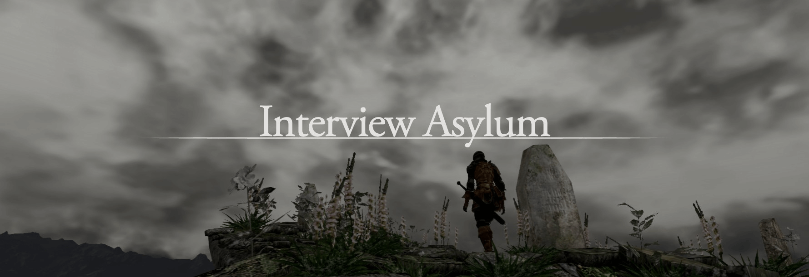

This Mini Book is for DevOps and Cloud Engineers leveling up from Semi-Senior Advanced to Senior roles.

For those already there, it could be a fun way to refresh your knowledge of how job interviews work. Think of it as a guide to help you sharpen your skills before you face those interview bosses.

⚠️ Spoilers: Since I’m revealing a lot of techniques and secrets, I’ve decided to make it Dark Souls-themed. 

---

---

# Core Mechanics

Before jumping to the other sections, we will expend some time exploring the mechanics. I have seen many people who try to go to an interview without preparation, which is possible when you either are getting to a level below what you currently are or have enough mileage to know how things go down from past experience with similar games.

## Character Creation

Creating a character that aligns with your mindset is best. Speaking from experience, it might seem cool to imitate someone else’s build, but in the end, everything flows more naturally when you’re aligned with your strengths.

 

 

In at least ten minutes during the beginning or middle of an interview, you'll likely be asked to summarize what you've been doing over the past few years—your process, achievements, challenges, and how you've overcome them.

That's why it is important to know yourself just enough so you don't have to improvise and waste mental bandwidth trying to articulate inputs/words.

**Suggested Actions:**
  - **Prepare a Speech:** It might feel challenging initially, especially if you're new to interviews or unfamiliar with English. But you don't want to wing it. Until you're more comfortable discussing your experience, preparing a concise overview and adapting your story to match what they want to hear is best.
    - By "adapting" your story, I mean talking to them about what you know about what they are looking for. They are not going to be interested (at first) in learning about the random pet project that you picked but rather the skills that you have that they need to fill the position.
    - Pay attention to their reactions. You'll know when something piques their interest—it could be that they're looking for a different approach or a more refined structure with X technology. Highlighting these key points is crucial.
  - **Be Familiar with Your Tech Stack**: Do not let the interview be the moment you realize what you didn't understand about your last role.
    - Avoid the dreaded "gaps" in your knowledge, where your answer is, "Yeah, but another guy/team handled that." It's understandable, but at least for general knowledge, you should be well-versed in the tools and methodologies you've worked with—especially if they're on your resume.
  - **Prioritize Rest Over Cramming**: I live by this rule: "Studying isn't worth sacrificing sleep." I figured out back in high school that being rested gives you the edge. The same goes for an interview, you'll perform far better when you're sharp and well-rested.

And above all, style can make a real difference. Keep your equipment in shape and make sure everything is working smoothly. The last thing you want to say is that you had an issue like "ugh controller disconnected and that's why things didn't go well."

## Level Thresholds

How you play this game depends totally on you, but it has a difficulty system that, after you reach a level threshold, tends to match the pace, so it doesn't get too easy, and fewer people can progress further unless they handle the mechanics correctly.

**Semi Senior**:
- Certifications are valid as an extension of knowledge and proof that you care about learning more.
- This type of certification aims to check what you know more than what you have done.
- Having side projects can be helpful to expand your knowledge of what you can use because of the tech stack of your last/current company. It depends a lot on - the interviewer how much it is worth it, but it is preferable to have something to not to have it at all.
- The difficulty may vary on the company you are applying to, but it depends on their expectations and the job you will do.

**Senior**:
I’ll expand on this because it’s more fun, and it is what you need to start practicing to shorten knowledge gaps. I’ll divide this into the following categories:

- Things to know: what are we facing, and how should we do it.
- First phase: knowing each other it’s part of the battle.
- Second phase: what you say it’s what you will get.
- Bonus phase feeling: love at first sight or based on small gestures.
- End phase: congrats!

## Types of Builds

Oh this section is going to be fun, but I'm not writing it yet. I'll leave some pointers to get around it eventually.

The following only applies upon your third or fourth run after the Senior threshold:

- Faith Stack.
- Techmancer.
- SME Strenght.
- MLG Developer.

---

 

 

---

---

# Preparation Bonfire

Yup, not so fast to the boss fight. We need to gather a few essential items before pushing forward. The good news? These items improve with time, but you’ll need them in your inventory to stand a chance.

You might be one of the hardcore ones, breezing through everything with 0% damage. But for the rest of us mere mortals, proper preparations are essential.

 

## Work Experience Over General Knowledge

Hands-on experience with tools is more valuable than theoretical knowledge. By the time you reach the mid-level (Ssr), you’re expected to know the essentials—this is the baseline.

Do we have here some General knowledge questions? Those are a separate challenge. But don’t worry. We’ve covered you with the [Interview Preparation](#interview-preparation) section to give you a glimpse of the critical topics.

 

## Certifications are Good, But...

They’re mostly just a way to skip the easy questions in interviews, but if you play your cards right, they can serve as leverage to claim even greater rewards.

- It’s tough for those who’ve put in a serious effort to get certified. Still, all a certification tells me is that you have time to study, a good memory, and probably a Cloud Guru subscription or whatever young ones use these days.
- Certifications can even backfire. That’s why I only certify in technologies I’m actively working with and have enough hands-on experience to support. Otherwise, it’s just cramming knowledge.
- If your approach is, “I want to dive deeper into X technology, and I’m using this certification as a challenge to find a related job,” that’s valid, too.

In short, if the certification supports your build, great! Otherwise, it’s like being a Strength build and wasting early points on learning a spell you can barely cast, leaving you open to attacks instead of focusing on fortifying your core skills.

 

## Accents

Since you're reading this, I assume you're comfortable with written and spoken English, which is safe. However, many underestimate the challenge of understanding everyday speech, especially from people who aren't native speakers.

A few takeaways:

- In tutorial videos, people often speak at a perfect pace and enunciate clearly. But in real life, it's common to encounter native speakers who mumble, rush through sentences, or use slang.
- You'll work with people worldwide, and only some people care about flawless grammar or polished speech as long as they can convey their message.
- Clients from other countries are patient and understanding with non-native speakers. So don't stress over it, you will **git gud**.
  - If you find some weird case... well It will make you stronger.

 

## Communication

Clear Communication is Crucial whether in interviews or building relationships with clients, the ability to explain your ideas is not just a must but a significant factor in your professional success. Preparation is your Estus Flask—it will keep you going. While there will come a time when you'll breeze through interviews, preparation is key until then.

With this in mind, at least you won’t stumble right out of the fog gate, giving off the wrong impression.

 

---

---

## Move Set

// I'll move the [Interview Preparation](#interview-preparation) section here, it makes more sense.

For this section we will go over the general attack patterns and how to counter them. C'mon it is just dogeing and hitting, how complicated can it gets?

  

    
<strong>Tell me about your experience</strong>

    <ul>
      <li>The interviewer wants to know about your experience. Briefly mention the technologies and projects you’ve worked on.</li>
      <li>Prepare this beforehand, focusing on what they might want to hear and highlighting your key achievements.</li>
    </ul>
  

  

    
<strong>What’s your level with X technology?</strong>

    <ul>
      <li>Your answer sets the difficulty of the questions. A safe option is “intermediate” if you’re unsure, but “advanced” or “expert” works if you have deep experience.</li>
      <li>Expect a more engaging conversation when both parties have high levels of knowledge.</li>
    </ul>
  

  

    
<strong>In this hypothetical scenario, how would you accomplish it?</strong>

    <ul>
      <li>This question aims to assess your understanding of architectures, workflows, and tools.</li>
      <li>You may not have direct experience, but knowing which tools are best is key. Multiple answers are common, so stick to what you’re confident with.</li>
      <li>They may challenge your answers to see how you react and adapt.</li>
    </ul>
  

  

    
<strong>Architecture types</strong>

    <ul>
      <li>At this level, you should be familiar with various architectures like microservices, monoliths, and event-driven systems, and know when each is appropriate.</li>
      <li>Expect questions like “What challenges would you face when using a microservice architecture from scratch?”</li>
    </ul>
  

  

    
<strong>What are the projects you have worked on?</strong>

    <ul>
      <li>The interviewer wants to see your hands-on experience. Be prepared to dive into the details of your most challenging projects.</li>
      <li>Highlight popular technologies to earn more points and steer follow-up questions.</li>
    </ul>
  

  

    
<strong>Cloud Provider Knowledge</strong>

    <ul>
      <li>Expect questions on VPC setup, Load Balancers, security best practices, and specific service knowledge (CloudFront, Lambda, SQS, etc.).</li>
      <li>Prepare for database-related questions: backups, configuration, and general use cases.</li>
    </ul>
  

  

    
<strong>Containers</strong>

    <ul>
      <li>Be ready for Docker and Kubernetes questions, including common commands, troubleshooting, service mesh, and Helm knowledge.</li>
    </ul>
  

  

    
<strong>Pipelines</strong>

    <ul>
      <li>Know how to automate everyday tasks, manage dependencies, and improve job speeds.</li>
      <li>Understand good practices around CI/CD pipelines.</li>
    </ul>
  

  

    
<strong>Automation IaC</strong>

    <ul>
      <li>Prepare for specific questions around Terraform (e.g., state locking, merging maps) and CloudFormation, including SAM and Serverless Framework.</li>
    </ul>
  

  

    
<strong>Automation Configuration Management</strong>

    <ul>
      <li>Expect questions about tools like Packer, Chef, and Ansible, and their differences.</li>
    </ul>
  

  

    
<strong>Security</strong>

    <ul>
      <li>“Do it with security in mind” applies to everything above.</li>
    </ul>
  

 

 

# Senior Interview Boss Fight

## First Phase

After the pleasantries, meet each other and explain a little about yourself. Usually, the interviewer will describe the technologies they are looking for and what they use, setting the tone. Or it can be at the end after testing you against some questions or after you talk about yourself. Therefore, you will find the common scenarios below based on my experience.

- **Rarely**: the interviewer starts from scratch, asking straightforward questions and increasing the difficulty slowly or based on your answers. It rarely happens because you require the meeting to be one hour long, which averages 30 minutes.
- **Sometimes**: the interviewer starts asking questions about the technologies it uses, expecting a similar level to him or decent answers. I like this type of interview because it’s faster and you can learn much from it.
- **Usually**: the interviewer asks you about your experience and questions based on what you tell him to dimension your level/skills. Of course, this applies if your knowledge matches 50-70 percent at least on what they do. It’s more challenging to interrogate someone on something the interviewer doesn’t work with—for example, a different Cloud Provider. If they are still willing to listen, common ground can be made based on similar approaches like troubleshooting, network configs, etc.

## Second Phase

Now that you are getting comfier, the nerves are calming, and the interviewer knows what you have to offer, the things below can happen.

- If the structured story of your experience were catching enough, the interviewer would be on the path to ask you about what you expect! Otherwise, improvise; you did all that you could. Congrats!
- An example of questions will be at the end. (Eventually)
  - I won’t go deep on those because they depend on your experience, the client's expectations, and the positions you are applying for.

## Bonus Phase: Feeling

Often ignored, people sometimes say, “yeah, I would like to work with him” or “I like him,” and that’s enough. So if you are not charismatic like me, check the points below.

- Interviewers look at and evaluate how people respond to things.
  - Internal questions like “How did he react when he didn’t understand or couldn’t respond,” “He missed the question and didn’t want to admit it,” or “Did he resist the pressure?”
- Easy to overlook, but companies are searching for a person to work with, and with the interview, they get a glance at the person’s character, and they will be stuck with you for a long time. It’s not about being a liability. It’s about not making things harder for others.
  - If you take minutes to answer simple questions or similar, don’t go anywhere when trying to answer, that’s a pretty good message to interviewers on how you are working.
- The engagement can make a difference, especially if the interviewer is the person you will be working with. If you don’t know, that’s okay. Depending on the interviewer, they will be willing to listen to you to get to the answer or something near. You can recover some points by explaining your reasoning and including him in the conversation.
  - It’s not about quitting before answering. It’s to try to figure it out. You will often get with clients and app owners, and they will expect a satisfactory answer in a short amount of time. There are tricks to handle that, but that’s sold separately.
  - But if you are stuck, be upfront of it but not with the intention of running.
- Troubleshooting is an essential skill. Finding a piece of code that does the trick we need is easier, but resolving issues specific to the company’s scenario is not easy.
  - Of course! Stackoverflow can save you from various things, but when you are stuck on a call against the clock and the issue is not common, you will see how much you understand how things work.
  - An old coworker told me, “Our jobs can be done through scripts and thus automated. We get paid because we can solve problems and our capacity to troubleshoot and adapt to new issues.” Or something like that. The story's moral is that when we resolve issues (complex) or architectural challenges, we show our way of thinking and how we handle ourselves.

## End Phase

At this point, the interview concludes, and the interviewer will tell you the next steps or close the door in your face. In any case, everything is a learning experience.

Depending on how you get the interview you may get feedback, by a third-party or by people of the same company.

// Will add some tips later
// Rejection path
// Acceptance path
// Internal challenges

# 

# Interview Preparation

You can google set of questions, but IMHO I prefer to hae pointers and go from there.

- **Tell me about your experience.**
  - The interviewer wants to know about your experience. Lol.
  - Briefly mention the technologies and projects that you worked on. You should spend the necessary amount of time here.
  - Prepare this beforehand, aiming at what they might want to hear, plus your highlights to use time wisely.
  - As long as it’s true, go for it.

- **What’s your level with X technology?**
  - Depending on your experience, this will set the difficulty of the questions. 
  - If unsure, a safe answer is “intermediate” so you, the interviewer, can start measuring you.
  - Advanced or expert are good options when you have much experience with a technology and multiple use case scenarios.
  - When two people have high levels, the interaction between questions, cases, and exceptions is fun.

- **In this hypothetical scenario, how would you accomplish it?**
  - This could vary, and its purpose is to get a gist of your mind map regarding architectures, workflows, and technologies.
  - You might not have experience with a particular scenario, but you should know which tool/service is the best and what you might have seen elsewhere.
  - There might be multiple answers. Usually, they are open about the answers to this kind of question.
  - There might be better solutions, but go with what you feel confident as a solution. They will use this as an opportunity to argue against you and see how you react and adapt to new focus changes.

- **Architecture types.**
  - Migration tasks provide you with a lot of experience on this topic.
  - You should know the possible types (micro-services, monoliths, event-driven, a mix, etc.) at this level, and when each is a better solution, along with their downsides.
  - Expect questions like “Which challenges would you face when using a microservice architecture from scratch? Setting dependencies, good practices, etc.”
  - You might also get questions like “Which LB should I use if I have an application that requires specific paths or redirects?”

- **What are the projects that you have worked on?**
  - The interviewer uses this to get a glimpse of what you have worked on and make you explain details that only a person involved would know.
  - The “most challenging project” variant tests how you perform and approach problems.
  - Prepare an answer to this beforehand, knowing your story.
  - Ideally, mention popular technology to give you more points and facilitate the follow-up questions.

- **Cloud Provider Knowledge:**
  - Setup up VPCs, peering, and subnetting.
  - Differences between Load Balancers and when to use them.
  - Types of policies, scopes, good practices, and security questions (e.g., Service Account or IAM role for a service?).
  - Options to access instances with SSH.
  - When and how to use CloudFront, including cache rules and behaviors.
  - WAF-related features, troubleshooting, and advantages.
  - Configuration of SQS/SNS and use case scenarios.
  - Cluster configuration.
  - Alarm configuration and setup. What can we monitor by default?
  - Log groups, permissions, and related.
  - CloudFormation nested stacks vs. cross-reference stacks.
  - Lambda knowledge (e.g., how to trigger a Lambda from S3?).
  - Event-driven architectures and integration with other AWS Services (e.g., Step functions, concurrency limitations).
  - Other services: When to use Kinesis, Cognito, types of databases, etc.
  - Database general knowledge: Use cases, configuration, backup, recovery, CLI commands.

- **Containers:**
  - Common Docker commands.
  - Dockerfile context.
  - Build and run containers.
  - Image registry questions: Push images, handle tags, etc.
  - Custom registries.
  - Cluster administration.
  - Types of services.
  - Knowledge of architectural concepts and requirements.
  - Troubleshooting.
  - Additional tools like Helm.
  - Service mesh.

- **Pipelines:**
  - Explain logic to automate everyday tasks.
  - Types of releases.
  - How to manage dependencies.
  - How to speed up jobs like builds.
  - Good practices.

- **Automation IaC:**
  - Specific cases: Similar to those on the certification, questions that prove that you have worked with the respective technology.
  - Terraform:
    - Why use a provider inside a module when calling it with for_each from the consumer level?
    - How to merge maps and determine which element overwrites the other?
    - When to lock states? Is it necessary?
  - CloudFormation: Popular for legacy and SAM deploys.
    - What’s SAM? Have you used Serverless Framework?
    - From 1 to 10, how much do you hate when the CloudFormation stacks explode and end up in a non-recoverable state?

- **Automation Configuration Management:**
  - Knowledge of Packer and the process of building AMIs.
  - Knowledge of Chef, Ansible, differences, advantages, and disadvantages.

- **Security:**
  - Add the “Do it with security in mind” to all points above.


<!-- Single Modal -->

  &times;
  

<!-- JavaScript for Modal Functionality -->


