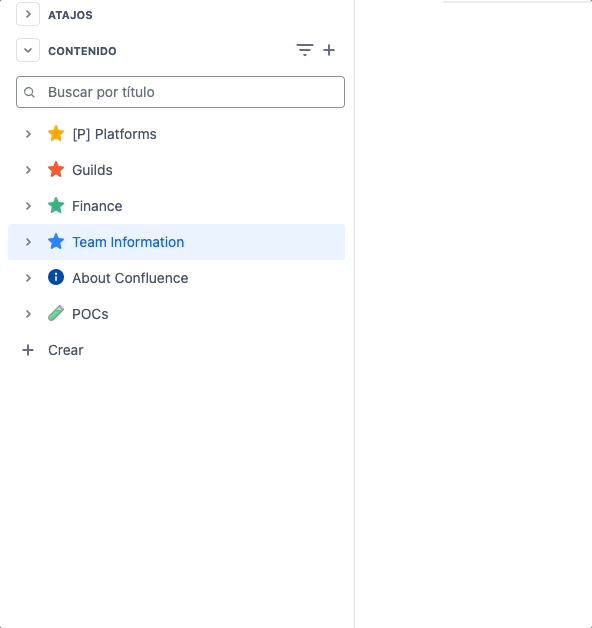
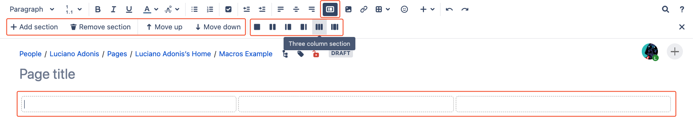

  <a href="/pages/airtable-chapter-0" class="custom-button right"><strong>Chapter 0</strong></a>
  <a href="/pages/airtable-chapter-2" class="custom-button left"><strong>Chapter 2</strong></a>

---

 

# Getting Started

In this chapter, we'll cover the basics to help you:

- Learn the sad difference between Cloud and Data Center versions.
- Understand how pages are organized.
- Get familiar with the Layout feature.
- Explore how to use Macros effectively.
- Search in Confluence.

With these foundations in place, we'll be ready to dive into the real fun.

 

## Cloud is Not the Same as Data Center

## Page Distribution

### Cloud Differences

In the Cloud version it allows you to quickly add new pages directly from the side menu rather than relying solely on the "Create" button.

Even though I was initially on the "Team Information" page, because I clicked the button to create a page from the "POCs" page, the new page was created, and I was automatically moved to the empty page under "POCs".

 

## Layouts

The Layout settings are often overlooked, as you can only see the menu after clicking the button highlighted in red:

The first time you click this button, it will add existing content to a single section. If you have a lot of content, there isn't a way around it; you must add more sections and separate them manually.

From left to right:
1. This first section will allow you to include rows, by default when you add a new one, this will be placed below the one that you are currently placed.
2. This section will allow you to set the distribution of the section row.

### Cloud Differences

The base layout doesn't cover the entire page but applies to just one section, and you can add more as needed. The options remain the same, though it's likely designed this way to be more responsive.

 

## Macros

The magic behind Confluence.

1. The plus button will open the menu where we can see standard macros.
2. Horizontal rule
3. Table of Contents.
4. Other macros: this last one will display the menu with the rest of the available macros installed.

For the following example we are going to search for the Code Block macro.

1. Using the search menu you can filter the results.
2. Click the macro.

For most macros, if not all, clicking it will open an insert menu for customization. Don't worry, you can always return to this menu by clicking 'edit' on the macro.

Things to make clear about this section are:

The options will depend on the macro, but they are worth checking. In some cases, they are a bit complex and may require additional knowledge.
- The preview menu lets you see how your changes will be reflected.

In most cases, you will first need to include content to appreciate how it changes, so in the next section, we will do that.

For this example, we are setting properties.

- Those will be reflected in the after the macro name.

 

## Search

It is not a skill issue, it really sucks. But there are ways to get better results.

When using the search keep in mind the following:
  - Limit the scope:
    - Filter by Space
    - Filter by User
  - Add tags:

Most of these little improvements can be optimized.

## Permissions

// Explain certain limitations to take actions.

 

---

  <a href="/pages/confluence-chapter-0" class="custom-button right"><strong>Chapter 0</strong></a>
  <a href="/pages/confluence-chapter-2" class="custom-button left"><strong>Chapter 2</strong></a>

