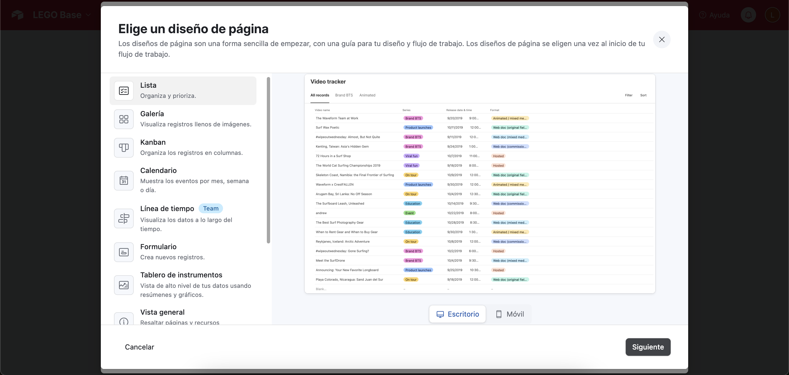
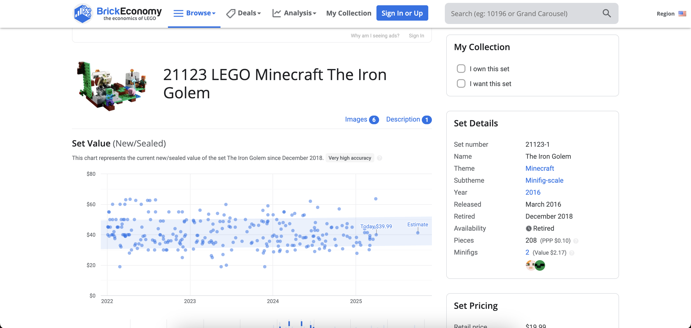

  <a href="/pages/airtable-chapter-1" class="custom-button right"><strong>Chapter 1</strong></a>
  <a href="/pages/airtable-chapter-3" class="custom-button left"><strong>Chapter 3</strong></a>

---

 

# Data Source

By default, selecting the demo example will generate data and interfaces automatically, but that's boring! Let's try something different from scratch. I have an interesting use case that will provide us with engaging data to work with... BrickEconomy! If you're not familiar, it's a site that lets you track your LEGO inventory as if the pieces were stocks...

There are several sites that help you manage your inventory and track prices. I've read that BrickEconomy's prices tend to be more optimistic compared to BrickLink. But this tutorial isn't about LEGO... at least not yet!

What makes this site valuable for our purposes is that we can export our product inventory as a CSV file, which we can then import into Airtable to explore most of its functionalities.

If you have faced a problem of keeping track of your things in spreadsheets you will know what could be the benefits. If you don't I'm glad that you are a healthy person.

 

## Importing the Data

By default this is how a base table will look:

The first time that you are importing data it will display this menu:

- This menu will allow you to correct or recategorize fields.

 

## Considerations

 

# Interface

 

## Creation

 

## Small Optimizations

 

## What's Next?

It looks decent, but is that all that we get?

And the answer is no! We also have images! But where? That's what are we going to solve on the next chapter!

---

  <a href="/pages/airtable-chapter-1" class="custom-button right"><strong>Chapter 1</strong></a>
  <a href="/pages/airtable-chapter-3" class="custom-button left"><strong>Chapter 3</strong></a>

