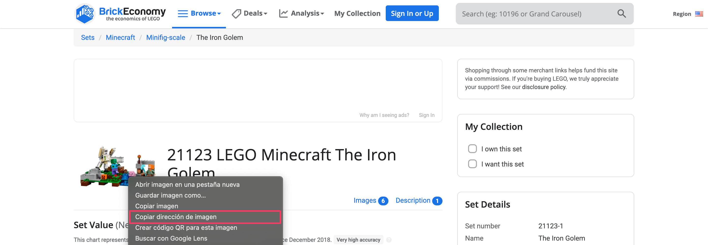
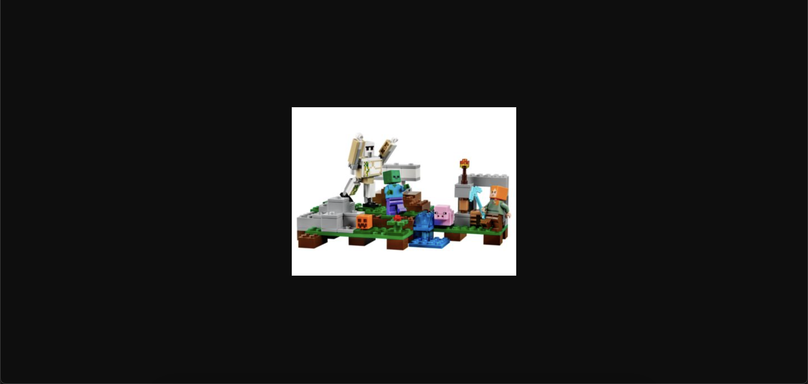
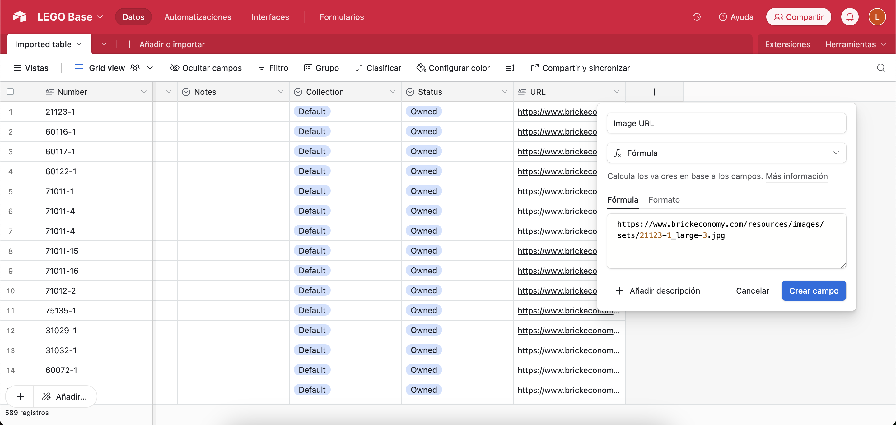
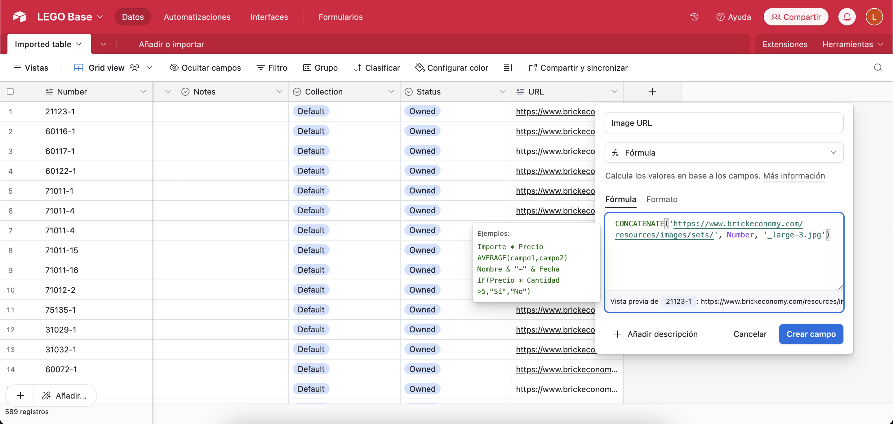
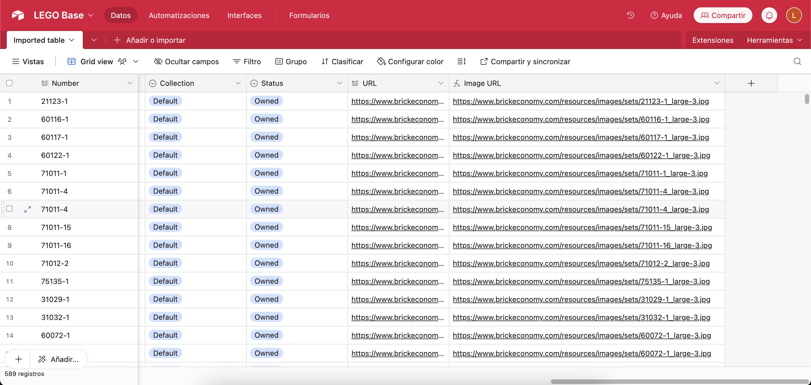
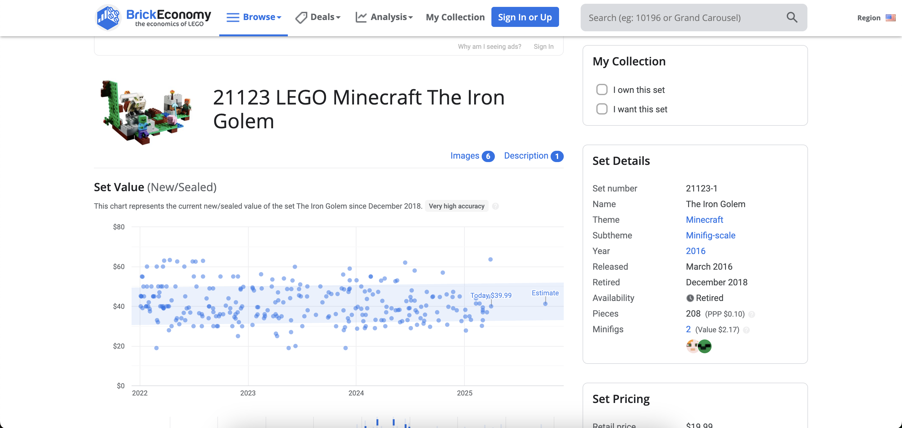
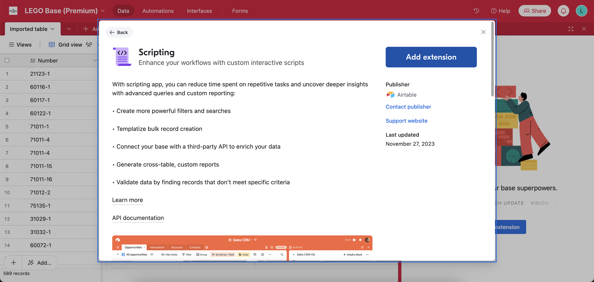
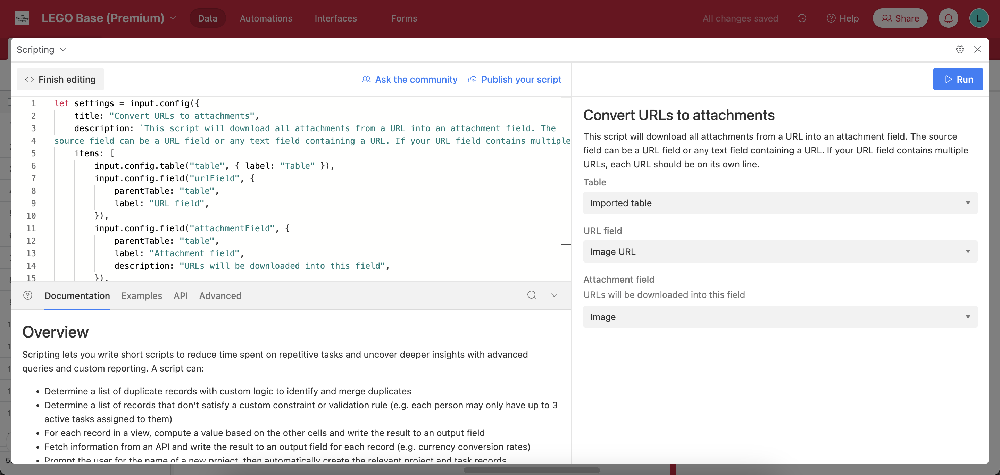
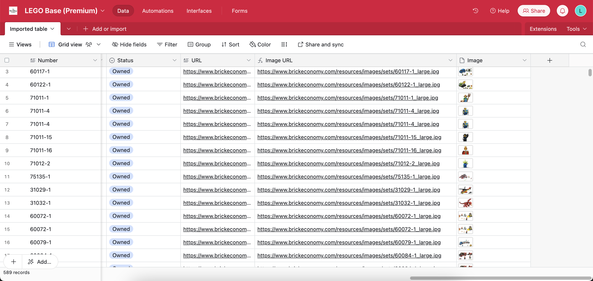

<div class="nav-buttons">
  <a href="/pages/airtable-chapter-2" class="custom-button right"><strong>Chapter 2</strong></a>
  <a href="/pages/airtable-chapter-3-5" class="custom-button middle"><strong>Chapter 3.5</strong></a>
  <a href="/pages/airtable-chapter-4" class="custom-button left"><strong>Chapter 4</strong></a>
</div>

---

<br>

# Formulas

In the last chapter, we noticied that we were missing the image attachment, which is understandable. But we need it! Trust me!



Right Click into the image and let's see what we get:

```
https://www.brickeconomy.com/resources/images/sets/21123-1_large-3.jpg
```

An URL... yeiii, which takes us to the image:



<br>

## Formula Field

Okay, what now?




```
https://www.brickeconomy.com/resources/images/sets/ + product_id + 'larger-3.jpg'
```





After checking I realized that not all pictures responded to the "larger-3", so I went with "larger".

<br>


# Image Generation

There are 500+ records, we definitely won't get each image manually... so we need to automate getting the main image for our interface.



There are three ways (at least) to accomplish this:

1. Airtable Scripting: most straightforward, requires Team plan.
2. MiniExtensions: can import images but you have to trigger the extension manually for each image... unless you pay the basic license (49 USD Monthly, a big nono) 
3. Make: more of the same. I think this is more useful for refined workflows, so we will skip this.

But before doing that, we will need to find out the image path.

<br>

## Image From URL

Specially if you are getting data from an API, you won't get the image directly, but there are ways to obtain them!



- [Convert URLs to attachments](https://airtable.com/marketplace/scrkPFUb7UtqFRXSP/convert-urls-to-attachments): This script will download all attachments from a URL into an attachment field. The source field can be a URL field or any text field containing a URL. If your URL field contains multiple URLs, each URL should be on its own line








<br>

---

<div class="nav-buttons">
  <a href="/pages/airtable-chapter-2" class="custom-button right"><strong>Chapter 2</strong></a>
  <a href="/pages/airtable-chapter-3-5" class="custom-button middle"><strong>Chapter 3.5</strong></a>
  <a href="/pages/airtable-chapter-4" class="custom-button left"><strong>Chapter 4</strong></a>
</div>