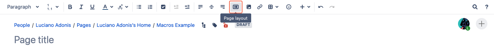
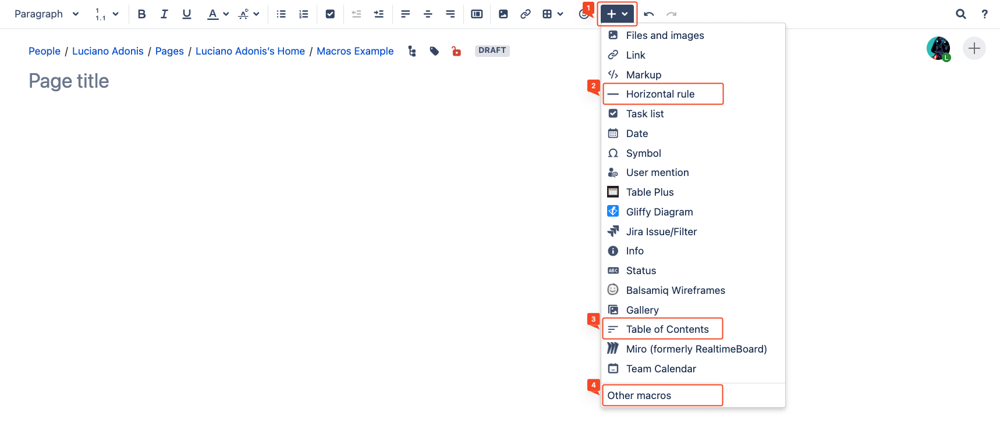
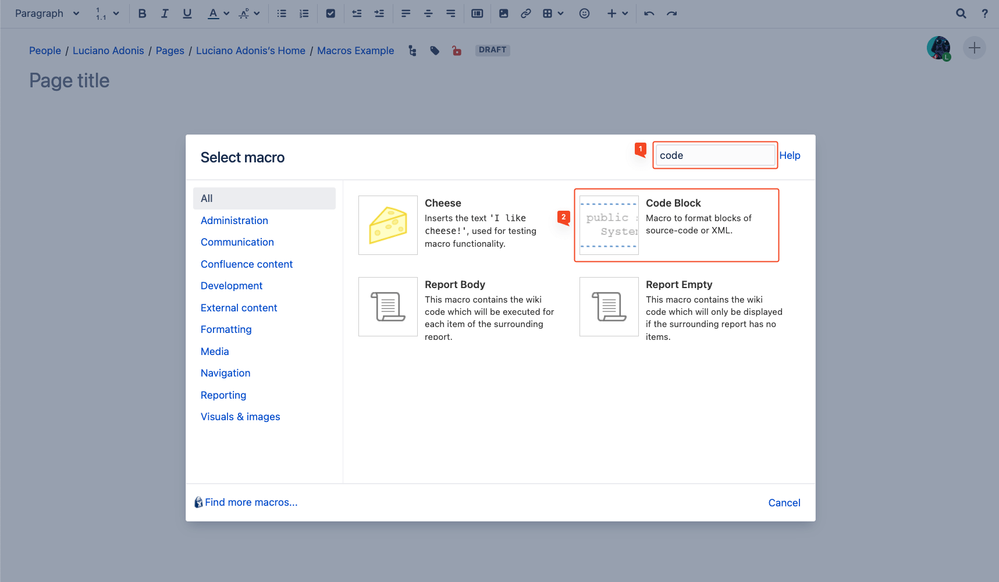
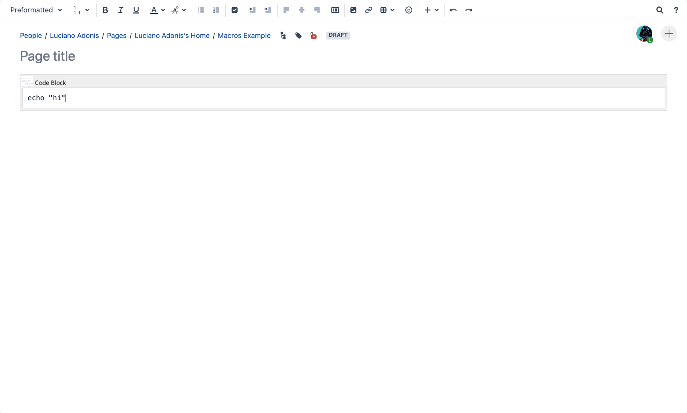

---

<a href="/confluence" class="button fork"><strong>Return</strong></a>

---

# Getting Started

 

## Page Distribution

When you create a new page, it will automatically be nested under **the page you were viewing** when you pressed the "Create" button. If you want your new page to be a child of a specific parent page, you must navigate to that page before creating it.

It's a common mistake that people often create pages without realizing where they are at the top level of the space, which can lead to drafts floating around at the top level. Not a huge problem, but it can make things messy very quickly.

To keep your space organized, double-check your location before you create a page. It's a quick step that can save you from having to clean up later.

You can also create pages in your personal space.

## Layouts

The Layout settings are often overlooked, as you can only see the menu after clicking the button highlighted in red:

The first time you click this button, it will add existing content to a single section. If you have a lot of content, there isn't a way around it; you must add more sections and separate them manually.

From left to right:
1. This first section will allow you to include rows, by default when you add a new one, this will be placed below the one that you are currently placed.
2. This section will allow you to set the distribution of the section row.

## Macros

The magic behind Confluence.

1. The plus button will open the menu where we can see standard macros.
2. Horizontal rule
3. Table of Contents.
4. Other macros: this last one will display the menu with the rest of the available macros installed.

For the following example we are going to search for the Code Block macro.

1. Using the search menu you can filter the results.
2. Click the macro.

For most macros, if not all, clicking it will open an insert menu for customization. Don't worry, you can always return to this menu by clicking 'edit' on the macro.

Things to make clear about this section are:

The options will depend on the macro, but they are worth checking. In some cases, they are a bit complex and may require additional knowledge.
- The preview menu lets you see how your changes will be reflected.

In most cases, you will first need to include content to appreciate how it changes, so in the next section, we will do that.

For this example, we are setting properties.

- Those will be reflected in the after the macro name.

---

<a href="/confluence-chapter-2" class="button fork"><strong>Chapter 2</strong></a>

---


<!-- Single Modal -->

  &times;
  

<!-- JavaScript for Modal Functionality -->


