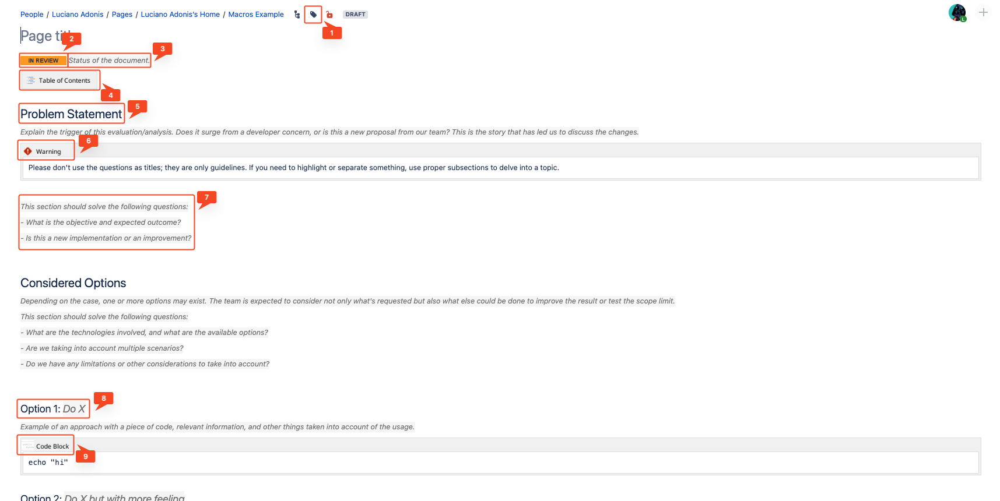

  <a href="/pages/confluence-chapter-1" class="custom-button right"><strong>Chapter 1</strong></a>
  <a href="/pages/confluence-chapter-3" class="custom-button left"><strong>Chapter 3</strong></a>

---

# Page Layouts

Often overlooked, [Page Layouts, Columns, and Sections](https://confluence.atlassian.com/doc/page-layouts-columns-and-sections-275188613.html) can significantly improve how you display content and help you to accentuate key points.

Instead of presenting your content as a dense, vertical monolith of text, you can transform the page space into a dynamic, engaging structure that captivates your audience.

 

## Making the Difference

The following page, a dummy (thanks, ChatGPT), would be your run-of-the-mill page in Confluence. Let's see it!

- It doesn't have cohesion.
- It feels awkward.
- It looks like some jotted-down pointers from the new hire.

I'm not mean. It is just Digital Feng Shui. Now let's continue with an "arranged" version of it:

- It could be improved! But it feels more natural and structured. They know what they are doing.
- Some extra colors may do some good, but let's keep it simple.

So, what happened? A few slight changes to the layout:

1. The title was adjusted to Level 3 to avoid distracting the reader from the content.
2. A section was defined for only that item so it doesn't collide with others.
3. Moved the text to make for a lengthy introduction.
4. The logo is displayed on the side, in the same size.
5. The Livesearch macro will now have a text to display, and it's kept under the logo.
6. The double section is distributed in 2/3 to have more space for text.
7. The difference with this section is that it has three columns. Whatever works for you!
8. Sometimes, having a section acting as a separator is more straightforward than adding many new lines to persist the separation.

You may say that it looks good, but it lacks personality as it may work as a page for documentation but not for a team presentation. If that's the case, you can skip right to the [Panels and Layout](#panels-cards-sections-and-layouts) section to see a more colorful example.

 

## Considerations

 

# Template Magic

One of the biggest problems that I have seen regarding people documentating is a lack of structure, so basically they expend more time wondering about how to do structure the page rather than sitting down to write.

By using a template you can limit the scope of the work, so instead of making something from nothing, they just have to fill the document with the proper information.

Before diving in types of structures, we have to discuss about ways to make the Template more obvious to the casual Confluence User.

 

## Facilitate the Usage

Instead of creating a normal page by clicking the 'Create' button, you have to select the three dots at the side. If you or your admin promoted the template, it will appear in the first options, and you can select it and finally have the format.

There are more straightforward ways to achieve this, but you may understand why people always miss this.

[Add Page via Form](https://apps-docs.servicerocket.com/x/mglb?utm_medium=confluence&utm_source=macro_editor). In later sections, we will board more Macros, but by now, this is what lets you define a button to create a page based on a defined template or Live Templates.

The Live Templates must be discussed separately, which can quickly get tricky.

 

## Complex Documents

An [Architecture Decision Record (ADR)](./pages/adrs.md) is a decent example of that! By "Complex" I'm referring to the lenght and the things that the page has to aboard.

In short, a document that get's you information relevant of how things where, what where the options, what was proposed and how changes were applied. I cannot state how helpful is to have that for both onboarding (as context) and for internal agreedments.

1. Page Tags can be part of the template! Make sure to set them.
2. The Badge Macro can help visualize the status. 
3. This is a Comment you will be seeing a lot.
4. I have seen people trying to make an index manually. To avoid that awkwardness, the Table of Contents will take care of it. So they only focus on writing.
5. You'll find Titles already defined with the proper level, saving you time and effort.
6. A Warning shouldn't be used like that. But in this case is enough to make something clear and have it as a reference that the macros exist.
7. The Comments can be helpful in clarifying the objectives of sections or other things to consider.
8. Example Subtitle with a Comment of the same level.
9. It's helpful to have some macros already in place, such as the Code Block, to convey the message that 'hey, this is possible and we've got you covered!'

## Simple Documents

After seeing the example of a Complex Document, you may wonder if you need much noise for everything. The answer is NO!

Where I'm currently working, we have two main patterns: for **Procedures** and **Troubleshooting**. Those can be summarized in:

- Predefined titles.
- Import of predefined requirements from a Datasource page.
- Short comments to guide the person's writing.
- Guidelines on how to format a few things:
  - Code: If the code/text in the block is lengthy, set it to "Expandable."
  - Images: size limited to a certain width and a border.

 

## Cloud Templates

The Cloud version has the advantage to have more variety and freedom to provide [Templates](https://www.atlassian.com/software/confluence/templates/categories/recommended).

From that link I picked just a few examples:

1. [Brainstorming](https://www.atlassian.com/software/confluence/templates/brainstorming)

    - In my opinion, the Cloud version seems to take more pride in using emojis, while Data Center docs often feel like they’re trying to turn into RFCs or some other clunky format.

2. [Project Plan](https://www.atlassian.com/software/confluence/templates/project-plan):

  - Besides Emojis and adding more colors, the titles main titles start at two, which is a good approach to avoid getting dizzy for the transtion of a higher case to a paragraph type.
  
  - Scrolling down there is a Macro that I haven't seen before:
  
    - Quite handy if you ever need it.

While these templates are great and can save time, **remember that not everything that shines is gold**. You should look beyond predefined templates and customize your workflow. Don't feel constrained by the structure—use these templates as a starting point, but have the insight to choose the right tools and create something unique!

The idea is not to go and reinvent the wheel but to have the insights to pick the right tools and come up with something intersting!

---

  <a href="/pages/confluence-chapter-1" class="custom-button right"><strong>Chapter 1</strong></a>
  <a href="/pages/confluence-chapter-3" class="custom-button left"><strong>Chapter 3</strong></a>

