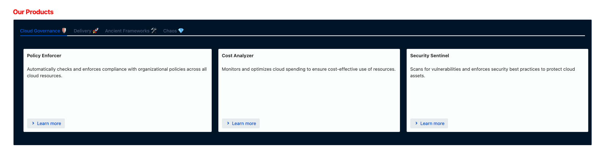
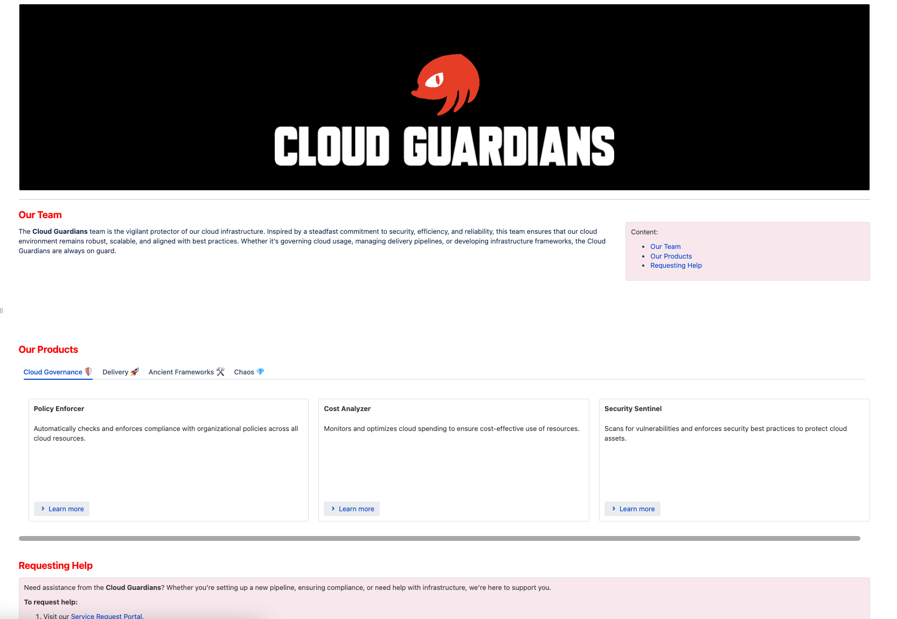
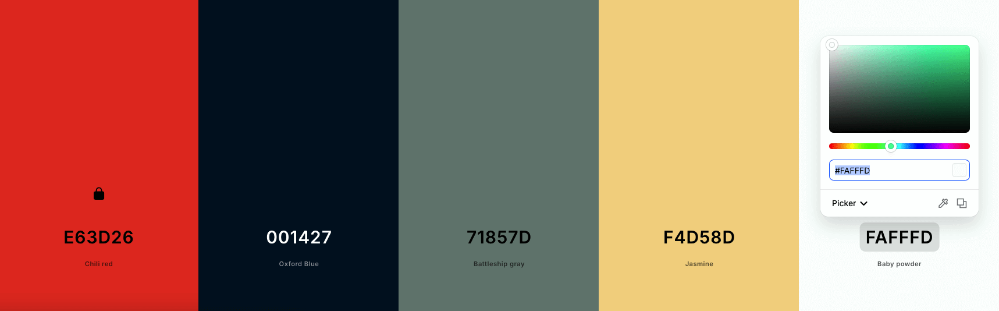
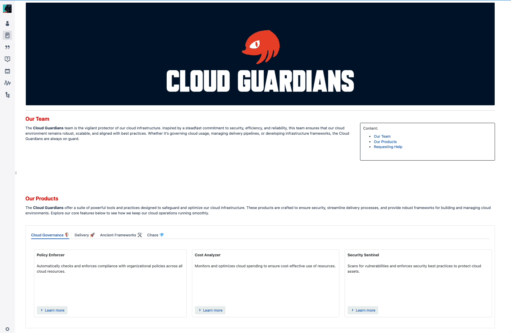

  <a href="/pages/confluence-chapter-2" class="custom-button right"><strong>Chapter 2</strong></a>
  <a href="/pages/confluence-chapter-4" class="custom-button left"><strong>Chapter 4</strong></a>

---

# Macros

Macros are plugins that enhance Confluence's functionality. A wide variety is available, from official options to community-created tools. While some are premium and offer advanced features, there are plenty of free options to explore.

You are probably already familiar with common plugins like:
- [Code Block](https://confluence.atlassian.com/doc/code-block-macro-139390.html)
- [Page Index](https://confluence.atlassian.com/doc/page-index-macro-182682092.html)
- [Status](https://confluence.atlassian.com/doc/status-macro-223222355.html)
- [Info, Tip, Note, and Warning](https://confluence.atlassian.com/doc/info-tip-note-and-warning-macros-51872369.html)

But there are a lot more combinations that you can make from them. The following section will include a list of amazing Macros worth checking out. 
There will be examples of a few combinations and how to make the most of them.

 

## Advanced Macros

I wouldn't suggest you going and trying all of them, instead go to the [next section](#simple-combination) to start learning simple combinations and go from there.

**Small Details:**

- [Table of Contents](https://confluence.atlassian.com/conf719/table-of-contents-macro-1157466923.html): Help readers navigate directly to specific sections of a page.
- [Expand Macro](https://confluence.atlassian.com/conf719/expand-macro-1157466749.html): Hide content, such as memes, within expandable sections.
- [Live Search](https://confluence.atlassian.com/conf719/livesearch-macro-1157466803.html): Add a search bar with predefined parameters.
- [Contributor Summary](https://confluence.atlassian.com/conf719/contributors-summary-macro-1157466730.html): Display recent updates from a page and its subpages.  
- [Alert](https://confluence.atlassian.com/doc/expand-macro-223222352.html): Create customizable alerts that display when a page loads.
- [Background Color](https://docs.adaptavist.com/cfm4cs/latest/content-formatting-macros/background-color): Change the background color of a page.

**Page Optimization:**
- [ChildTabs](https://docs.bitvoodoo.app/navitabs-tabs-for-confluence-data-center/?utm_source=bv-app&utm_medium=Editor&utm_campaign=Navitabs%20Child%20Tabs%20Macro): Navigate between pages easily; view content from child pages without opening multiple tabs.
- [Include Page](https://confluence.atlassian.com/conf85/include-page-macro-1283360210.html): Display content from another page or blog post.
- [Form](https://docs.adaptavist.com/f4cs/latest/usage/adding-a-form-to-a-page): Add a text box and submit button for creating a new page, with options for templates or parent pages.
- [Page Properties Report](https://support.atlassian.com/confluence-cloud/docs/insert-the-page-properties-report-macro/): Create reports from multiple pages using the Page Properties macro.
- [Page Properties](https://confluence.atlassian.com/conf719/page-properties-macro-1157466835.html): Combine with Page Properties Report to create a table of information from multiple pages.
- [Content Report Table](https://confluence.atlassian.com/conf85/content-report-table-macro-1283360159.html): Generate a content report in table format based on labels.
- [Multiexcerpt](https://confluence.atlassian.com/conf719/excerpt-macro-1157466743.html): Export multiple elements like text and images across Spaces and Pages, and reuse them with the [Multiexcerpt Include](https://confluence.atlassian.com/conf719/excerpt-include-macro-1157466741.html).
- [Excerpt](https://confluence.atlassian.com/conf719/excerpt-macro-1157466743.html): Define a snippet of content for reuse on another page.
- [Table Excerpt](https://docs.stiltsoft.com/tfac/dc-server/how-to-use-table-excerpt-and-table-excerpt-include-macros-42241623.html): Reuse tables from one page to another by using the [Table Include](https://docs.stiltsoft.com/tfac/dc-server/how-to-use-table-excerpt-and-table-excerpt-include-macros-42241623.html) macro.
- [Table Filter](https://docs.stiltsoft.com/tfac/cloud/how-to-use-table-filter-macro-42239756.html): Query data across multiple pages.

**Page Organization:**

- [Deck of Cards](https://appfire.atlassian.net/wiki/spaces/CTFCSM/pages/471176665/Deck+of+Cards): tabs for multiple tabs made by individual [Cards](https://appfire.atlassian.net/wiki/spaces/CTFCSM/pages/471176639/Card).
- [Definition List](https://www.smartics.eu/confluence/display/CONFMAC/Definition+List+Macro): Render terms and definitions in a list format.
- [Column](https://confluence.atlassian.com/doc/column-macro-51872396.html)
- [Section](https://confluence.atlassian.com/doc/section-macro-51872531.html)
- [Panel](https://confluence.atlassian.com/doc/panel-macro-51872380.html)
- [Span](https://docs.adaptavist.com/cfm4cs/latest/content-formatting-macros/span)

**Pay To Win Macros:**

- [Bob Swift - Markdown](https://appfire.atlassian.net/wiki/spaces/MARKDOWN/pages/72386542/Cloud): allows you to connect to Gitlab, Github and Bitbucket using defined profiles.
  - Default Markdown Plugin doesn't have the features to use authentication, for Gist it may be useful.
- [Bob Swift - HTML](https://appfire.atlassian.net/wiki/spaces/HTML/pages/70617206/Html-bobswift+macro): renders content from HTML.
  - Default [HTML Include](https://confluence.atlassian.com/conf85/html-include-macro-1283360207.html) plugin may be disable by default as it could make the site vulnerable to cross-site scripting attacks.
- [Comala - Questions](): it makes a space to have questions that you can filter an render in pages.

## Cloud Macros

## Hardcore Macros

- Live Templates.

# Macro Combinations

Macros are comparable to Terraform functions. It's essential to recognize that there are easier ways to accomplish tasks. Yet, to fully leverage the tool, it's crucial to stretch its capabilities and intertwine multiple functions with a specific goal in mind.

## Practical Enhancements

Sometimes people don't use certain options of their macros which can impact in the way things are felt.

If you document is heavy on code I could assume your readers won't care most of the time in the code itself but rather what you are talking about. For those cases, the expand option from the Code Macro will make a difference.

This can also be done for images of even sections, with the expand macros. I personally hid memes this way.

## Quick Wins

If you've only got the mental bandwidth for a few Macros, prioritize the following macros to get ahead of multiple documentations:

* [Multiexcerpt](https://confluence.atlassian.com/conf719/excerpt-macro-1157466743.html): I consider [Multiexcerpt Include](https://confluence.atlassian.com/conf719/excerpt-include-macro-1157466741.html) to be part of it, so it counts as one. This will allow you to reuse content in other pages. Like coding!
* [Table Filter](https://docs.stiltsoft.com/tfac/cloud/how-to-use-table-filter-macro-42239756.html): There are such great things that you can do with filters and queries. It's sad that you have to but at least is not painful!
- [ChildTabs](https://docs.bitvoodoo.app/navitabs-tabs-for-confluence-data-center/?utm_source=bv-app&utm_medium=Editor&utm_campaign=Navitabs%20Child%20Tabs%20Macro): For when you've got a bunch of subpages—this helps you keep it all organized without endless tabs.

In the following example, the main page "Macros Example" displays two results with the ChildTabs that are the pages under it. The context behind those pages will be explained in the Datasource Page's [example](#example-1). Still, you must know that separated pages are loaded simultaneously and quickly accessible through the parent page.

The cross-reference between those is not limited by location but just for simplicity.

 

## Panels, Cards, Sections, and Layouts

The [Panel](https://confluence.atlassian.com/conf719/panel-macro-1157466870.html) allows to create a section with colored background, but you can get more creative and do more by also using it with [Deck of Cards](https://appfire.atlassian.net/wiki/spaces/CTFCSM/pages/471176665/Deck+of+Cards)

Let's begin with a new page example, the 'Cloud Guardians' team:

Compared to the first example of the 'Gotta Go Fast' team, it looks more imposing. Even though it seems similar, there are a lot of changes, but for now, let's focus on the main ones:

- The page contains a logo with a background.
- Titles are in red to match the theme.
- The content table is on the side with a slightly different color (baby powder, precisely).
- There is a section with tabs and cards containing information about products.

It may look similar to the configuration, but it has its nuances. Starting from the title:

1. A Panel sets the background to match set the color. 
2. The Knuckles SEGA logo is centered and has a smaller size.
3. The title image was generated using the Tech Headlines font on the [Font SpaceTech](https://www.fontspace.com/) site.
    - It looks invisible as I change it with the MacOS image editor to be white and compatible with the background.
4. A simple line made with the Horizontal Rule macro separates the contents from the logo.
  - Not much thought was put into it; it felt right.
5. Next section is divided with a Layout section of 2/3.
6. Titles start at level 2 with red color. This makes the transition from huge L1 text to normal-sized paragraphs less weird.  
7. We use the Panel macro with a background of #FAFFFD (Baby Powder color) to highlight the content section, ensuring important sections stand out.
8. We make sure the Content Table section contains the rule to start at level 2; otherwise, it will have a weird indentation.

And well, that was the fun part. For the next part we will see the Deck of Cards,
Let's first refresh the Macros that we will use for this section:

1. [Deck of Cards](https://appfire.atlassian.net/wiki/spaces/CTFCSM/pages/471176665/Deck+of+Cards)
2. [Section](https://confluence.atlassian.com/doc/section-macro-51872531.html)
3. [Column](https://confluence.atlassian.com/doc/column-macro-51872396.html)
4. [Section](https://confluence.atlassian.com/doc/section-macro-51872531.html)
5. [Panel](https://confluence.atlassian.com/doc/panel-macro-51872380.html)
6. [Span](https://docs.adaptavist.com/cfm4cs/latest/content-formatting-macros/span)

Please note that for screenshots, the last card of the first tab won't be visible. You're not missing anything.

Yeah, I know. It's quite messy to read and probably hard to edit, too. However, I can only say that the result is worth the trouble.

So it goes like this:

1. Originally the first Panel was going to set a different color for the whole Deck of Cards, but it didn't looked right, so I avoided doing it like that. See images below to understand the pain:
  
  On that note, keep in mind that other Macros do not render in the preview:
  
2. The Deck of Cards creates horizontal tabs containing one or multiple Cards.  
3. Inside of a Card we will have the Section.
4. Section will contain the Column macro.
5. Column will have a Panel.
6. Each Panel will have the text and display using a Span.
7. The Span is used for set parameters to the block and have consistency.
8. A Button Hyperlink is used to provide a way for users to access the other links related to each Product.
9. The rest of Columns follow the same pattern. The percentage associated with it may variate but it is suggested to stick to percentages to not have issues when displaying.

### Optimized Colors and Contrast

Originally the example didn't looked like the one shown before. It was like this:

    
Click to expand

    

      
    

  

 

Even thought it may look alright, reading with highcontrast or weird colors can throw your attention away.

There are plenty of tools to get ideas of how to get better colors based on a palette by either of concepts of complementary colors or the like.

For this site I used Coolors, and took as main color the Knuckles red (#E63D26) locked that color and started generating palettes like pulling for a Gacha Character, and in the end I went with the Baby Powder as it was more subtle.
 

The contrast is another element to keep in mind if you are going to user bright colors. As it may affect the readiblity and chakra mislalignment.

Just to recap:
- Be mindful of the colors that you use.
- If you are unsure of what to use, there are plenty of tools that can give you an answer regarding if a color is balanced with the existent or if the contrast of the text and background is correct.

## Buttons

You can [Customize Button Hyperlink With CSS](https://docs.adaptavist.com/cfm4cs/latest/content-formatting-macros/button-hyperlink/customize-button-hyperlink-with-css) by using the [CSS Style Sheet](https://docs.adaptavist.com/cfm4cs/latest/content-formatting-macros/css-style-sheet)

---

  <a href="/pages/confluence-chapter-2" class="custom-button right"><strong>Chapter 2</strong></a>
  <a href="/pages/confluence-chapter-4" class="custom-button left"><strong>Chapter 4</strong></a>

