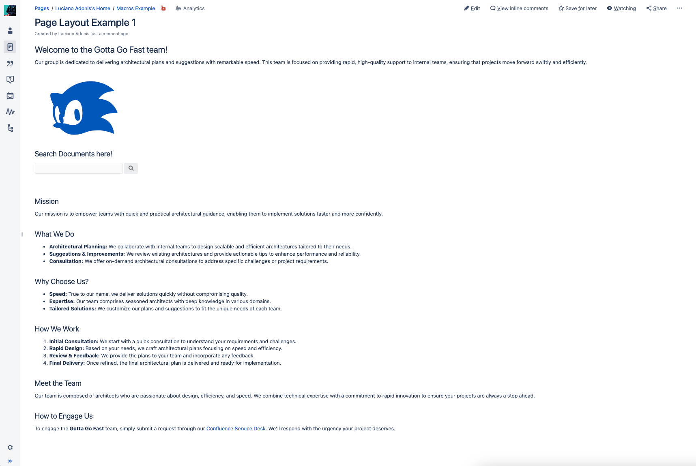

>"To plant a garden is to believe in tomorrow." – Audrey Hepburn

Based on my experience, when you facilitate the patterns and tools to make documenting less taxing, people will be more willing to cooperate and improve things. When they see the value it provides, it is easier to invest time knowing that it will be helpful to someone, even if that person is yourself in the future.

Unless you have read or seen good examples, you probably don’t know how to get to that point or what tools to use to get there or at least closer, so this mini-book tries to solve that!

I’ll try to be as structured as possible when building from scratch rather than trying to jump into complex topics like Dynamic Documentation—oh yes, it gets better.

To simplify each section we are going to go for the edition basics in the first part.

# Getting Started

I'll skip how to login and click the create a Page...

// damn, explain the structuring process.

## Layouts

## Macros

In general, most Macros won't render and will make a block where you can add things.

When editing the macro itself you will be able to preview with its contents already defined. Which in most cases will make a lot of sense.

# Page Layouts

Often overlooked, [Page Layouts, Columns, and Sections](https://confluence.atlassian.com/doc/page-layouts-columns-and-sections-275188613.html) can significantly improve how you display content and help you to accentuate key points.

Instead of presenting your content as a dense, vertical monolith of text, you can transform the page space into a dynamic, engaging structure that captivates your audience.

## Making the Difference

The following page, a dummy (thanks, ChatGPT), would be your run-of-the-mill page in Confluence. Let's see it!

- It doesn't have cohesion.
- It feels awkward.
- It looks like some jotted-down pointers from the new hire.

I'm not mean. It is just Digital Feng Shui. Now let's continue with an "arranged" version of it:

- It could be improved! But it feels more natural and structured. They know what they are doing.
- Some extra colors may do some good, but let's keep it simple.

So, what happened? A few slight changes to the layout:

1. The title was adjusted to Level 3 to avoid distracting the reader from the content.
2. A section was defined for only that item so it doesn't collide with others.
3. Moved the text to make for a lengthy introduction.
4. The logo is displayed on the side, in the same size.
5. The Livesearch macro will now have a text to display, and it's kept under the logo.
6. The double section is distributed in 2/3 to have more space for text.
7. The difference with this section is that it has three columns. Whatever works for you!
8. Sometimes, having a section acting as a separator is more straightforward than adding many new lines to persist the separation.

You may say that it looks good, but it lacks personality as it may work as a page for documentation but not for a team presentation. If that's the case, you can skip right to the [Panels and Layout](#panels-cards-sections-and-layouts) section to see a more colorful example.

## Considerations

# Template Magic

One of the biggest problems that I have seen regarding people documentating is a lack of structure, so basically they expend more time wondering about how to do structure the page rather than sitting down to write.

By using a template you can reduce the scope of doing that and have a limited scope of what they need to provide, so instead of making something from nothing, they just have to fill with the proper information.

Before diving in types of structures, we have to discuss about ways to make the Template more obvious to the casual Confluence User.

## Facilitate the Usage

Instead of creating a normal page by clicking the 'Create' button, you have to select the three dots at the side. If you or your admin promoted the template, it will appear in the first options, and you can select it and finally have the format.

There are more straightforward ways to achieve this, but you may understand why people always miss this.

[Add Page via Form](https://apps-docs.servicerocket.com/x/mglb?utm_medium=confluence&utm_source=macro_editor). In later sections, we will board more Macros, but by now, this is what lets you define a button to create a page based on a defined template or Live Templates.

The Live Templates must be discussed separately, which can quickly get tricky.

## Working With Complex Documents

An [Architecture Decision Record (ADR)](./pages/adrs.md) is a decent example of that! By "Complex" I'm referring to the lenght and the things that the page has to aboard.

In short, a document that get's you information relevant of how things where, what where the options, what was proposed and how changes were applied. I cannot state how helpful is to have that for both onboarding (as context) and for internal agreedments.

1. Page Tags can be part of the template! Make sure to set them.
2. The Badge Macro can help visualize the status. 
3. This is a Comment you will be seeing a lot.
4. I have seen people trying to make an index manually. To avoid that awkwardness, the Table of Contents will take care of it. So they only focus on writing.
5. You'll find Titles already defined with the proper level, saving you time and effort.
6. A Warning shouldn't be used like that. But in this case is enough to make something clear and have it as a reference that the macros exist.
7. The Comments can be helpful in clarifying the objectives of sections or other things to consider.
8. Example Subtitle with a Comment of the same level.
9. It's helpful to have some macros already in place, such as the Code Block, to convey the message that 'hey, this is possible and we've got you covered!'

## Working With Simple Documents

After seeing the example of a Complex Document, you may wonder if you need much noise for everything. The answer is NO!

Where I'm currently working, we have two main patterns: for **Procedures** and **Troubleshooting**. Those can be summarized in:

- Predefined titles.
- Import of predefined requirements from a Datasource page.
- Short comments to guide the person's writing.
- Guidelines on how to format a few things:
  - Code: If the code/text in the block is lengthy, set it to "Expandable."
  - Images: size limited to a certain width and a border.

# Macros

Macros are plugins that enhance Confluence's functionality. A wide variety is available, from official options to community-created tools. While some are premium and offer advanced features, there are plenty of free options to explore.

You are probably already familiar with common plugins like:
- [Code Block](https://confluence.atlassian.com/doc/code-block-macro-139390.html)
- [Page Index](https://confluence.atlassian.com/doc/page-index-macro-182682092.html)
- [Status](https://confluence.atlassian.com/doc/status-macro-223222355.html)
- [Info, Tip, Note, and Warning](https://confluence.atlassian.com/doc/info-tip-note-and-warning-macros-51872369.html)

But there are a lot more combinations that you can make from them. The following section will include a list of amazing Macros worth checking out. 
There will be examples of a few combinations and how to make the most of them.

## Advanced Macros

I wouldn't suggest you going and trying all of them, instead go to the [next section](#simple-combination) to start learning simple combinations and go from there.

- [Multiexcerpt](https://confluence.atlassian.com/conf719/excerpt-macro-1157466743.html): Export multiple elements like text and images across Spaces and Pages, and reuse them with the [Multiexcerpt Include](https://confluence.atlassian.com/conf719/excerpt-include-macro-1157466741.html).
- [Table Excerpt](https://docs.stiltsoft.com/tfac/dc-server/how-to-use-table-excerpt-and-table-excerpt-include-macros-42241623.html): Reuse tables from one page to another by using the [Table Include](https://docs.stiltsoft.com/tfac/dc-server/how-to-use-table-excerpt-and-table-excerpt-include-macros-42241623.html) macro.
- [Table Filter](https://docs.stiltsoft.com/tfac/cloud/how-to-use-table-filter-macro-42239756.html): Query data across multiple pages.
- [Live Search](https://confluence.atlassian.com/conf719/livesearch-macro-1157466803.html): Add a search bar with predefined parameters.
- [Contributor Summary](https://confluence.atlassian.com/conf719/contributors-summary-macro-1157466730.html): Display recent updates from a page and its subpages.  
- [Expand Macro](https://confluence.atlassian.com/conf719/expand-macro-1157466749.html): Hide content, such as memes, within expandable sections.
- [Page Properties Report](https://support.atlassian.com/confluence-cloud/docs/insert-the-page-properties-report-macro/): Create reports from multiple pages using the Page Properties macro.
- [Definition List](https://www.smartics.eu/confluence/display/CONFMAC/Definition+List+Macro): Render terms and definitions in a list format.
- [Panel](https://confluence.atlassian.com/conf719/panel-macro-1157466870.html): Add a customizable colored panel to format text.
- [Deck of Cards](https://appfire.atlassian.net/wiki/spaces/CTFCSM/pages/471176665/Deck+of+Cards): tabs for multiple tabs made by individual [Cards](https://appfire.atlassian.net/wiki/spaces/CTFCSM/pages/471176639/Card).
- [Page Properties](https://confluence.atlassian.com/conf719/page-properties-macro-1157466835.html): Combine with Page Properties Report to create a table of information from multiple pages.
- [Excerpt](https://confluence.atlassian.com/conf719/excerpt-macro-1157466743.html): Define a snippet of content for reuse on another page.
- [Live Search](https://confluence.atlassian.com/conf719/livesearch-macro-1157466803.html): Add a customizable search field to a page.
- [Table of Contents](https://confluence.atlassian.com/conf719/table-of-contents-macro-1157466923.html): Help readers navigate directly to specific sections of a page.
- [Background Color](https://docs.adaptavist.com/cfm4cs/latest/content-formatting-macros/background-color): Change the background color of a page.
- [Include Page](https://confluence.atlassian.com/conf85/include-page-macro-1283360210.html): Display content from another page or blog post.
- [Form](https://docs.adaptavist.com/f4cs/latest/usage/adding-a-form-to-a-page): Add a text box and submit button for creating a new page, with options for templates or parent pages.
- [Content Report Table](https://confluence.atlassian.com/conf85/content-report-table-macro-1283360159.html): Generate a content report in table format based on labels.
- [ChildTabs](https://docs.bitvoodoo.app/navitabs-tabs-for-confluence-data-center/?utm_source=bv-app&utm_medium=Editor&utm_campaign=Navitabs%20Child%20Tabs%20Macro): Navigate between pages easily; view content from child pages without opening multiple tabs.
- [Expand](https://confluence.atlassian.com/doc/expand-macro-223222352.html): Add expandable/collapsible sections to your page.
- [Alert](https://confluence.atlassian.com/doc/expand-macro-223222352.html): Create customizable alerts that display when a page loads.
- [Column](https://confluence.atlassian.com/doc/column-macro-51872396.html)
- [Section](https://confluence.atlassian.com/doc/section-macro-51872531.html)
- [Panel](https://confluence.atlassian.com/doc/panel-macro-51872380.html)
- [Span](https://docs.adaptavist.com/cfm4cs/latest/content-formatting-macros/span)

## Hardcore Macros

- Live Templates.

# Macro Combinations

Macros are comparable to Terraform functions. It's essential to recognize that there are easier ways to accomplish tasks. Yet, to fully leverage the tool, it's crucial to stretch its capabilities and intertwine multiple functions with a specific goal in mind.

## Practical Enhancements

Sometimes people don't use certain options of their macros which can impact in the way things are felt.

If you document is heavy on code I could assume your readers won't care most of the time in the code itself but rather what you are talking about. For those cases, the expand option from the Code Macro will make a difference.

This can also be done for images of even sections, with the expand macros. I personally hid memes this way.

## Quick Wins

If you’ve only got the mental bandwidth for a few Macros, prioritize the following macros to get ahead of multiple documentations:

* [Multiexcerpt](https://confluence.atlassian.com/conf719/excerpt-macro-1157466743.html): I consider [Multiexcerpt Include](https://confluence.atlassian.com/conf719/excerpt-include-macro-1157466741.html) to be part of it, so it counts as one. This will allow you to reuse content in other pages. Like coding!
* [Table Filter](https://docs.stiltsoft.com/tfac/cloud/how-to-use-table-filter-macro-42239756.html): There are such great things that you can do with filters and queries. It's sad that you have to but at least is not painful!
- [ChildTabs](https://docs.bitvoodoo.app/navitabs-tabs-for-confluence-data-center/?utm_source=bv-app&utm_medium=Editor&utm_campaign=Navitabs%20Child%20Tabs%20Macro): For when you’ve got a bunch of subpages—this helps you keep it all organized without endless tabs.

In the following example, the main page "Macros Example" displays two results with the ChildTabs that are the pages under it. The context behind those pages will be explained in the Datasource Page's [example](#example-1). Still, you must know that separated pages are loaded simultaneously and quickly accessible through the parent page.

The cross-reference between those is not limited by location but just for simplicity.

 

## Panels, Cards, Sections, and Layouts

The [Panel](https://confluence.atlassian.com/conf719/panel-macro-1157466870.html) allows to create a section with colored background, but you can get more creative and do more by also using it with [Deck of Cards](https://appfire.atlassian.net/wiki/spaces/CTFCSM/pages/471176665/Deck+of+Cards)

Let's begin with a new page example, the 'Cloud Guardians' team:

Compared to the first example of the 'Gotta Go Fast' team, it looks more imposing. Even though it seems similar, there are a lot of changes, but for now, let's focus on the main ones:

- The page contains a logo with a background.
- Titles are in red to match the theme.
- The content table is on the side with a slightly different color (baby powder, precisely).
- There is a section with tabs and cards containing information about products.

It may look similar to the configuration, but it has its nuances. Starting from the title:

1. A Panel sets the background to match set the color. 
2. The Knuckles SEGA logo is centered and has a smaller size.
3. The title image was generated using the Tech Headlines font on the [Font SpaceTech](https://www.fontspace.com/) site.
    - It looks invisible as I change it with the MacOS image editor to be white and compatible with the background.
4. A simple line made with the Horizontal Rule macro separates the contents from the logo.
  - Not much thought was put into it; it felt right.
5. Next section is divided with a Layout section of 2/3.
6. Titles start at level 2 with red color. This makes the transition from huge L1 text to normal-sized paragraphs less weird.  
7. We use the Panel macro with a background of #FAFFFD (Baby Powder color) to highlight the content section, ensuring important sections stand out.
8. We make sure the Content Table section contains the rule to start at level 2; otherwise, it will have a weird indentation.

And well, that was the fun part. For the next part we will see the Deck of Cards,
Let's first refresh the Macros that we will use for this section:

1. [Deck of Cards](https://appfire.atlassian.net/wiki/spaces/CTFCSM/pages/471176665/Deck+of+Cards)
2. [Section](https://confluence.atlassian.com/doc/section-macro-51872531.html)
3. [Column](https://confluence.atlassian.com/doc/column-macro-51872396.html)
4. [Section](https://confluence.atlassian.com/doc/section-macro-51872531.html)
5. [Panel](https://confluence.atlassian.com/doc/panel-macro-51872380.html)
6. [Span](https://docs.adaptavist.com/cfm4cs/latest/content-formatting-macros/span)

Please note that for screenshots, the last card of the first tab won't be visible. You're not missing anything.

Yeah, I know. It's quite messy to read and probably hard to edit, too. However, I can only say that the result is worth the trouble.

So it goes like this:

1. Originally the first Panel was going to set a different color for the whole Deck of Cards, but it didn't looked right, so I avoided doing it like that. See images below to understand the pain:
  
  On that note, keep in mind that other Macros do not render in the preview:
  
2. The Deck of Cards creates horizontal tabs containing one or multiple Cards.  
3. Inside of a Card we will have the Section.
4. Section will contain the Column macro.
5. Column will have a Panel.
6. Each Panel will have the text and display using a Span.
7. The Span is used for set parameters to the block and have consistency.
8. A Button Hyperlink is used to provide a way for users to access the other links related to each Product.
9. The rest of Columns follow the same pattern. The percentage associated with it may variate but it is suggested to stick to percentages to not have issues when displaying.

### Optimized Colors and Contrast

Originally the example didn't looked like the one shown before. It was like this:

    
Click to expand

    

      
    

  

 

Even thought it may look alright, reading with highcontrast or weird colors can throw your attention away.

There are plenty of tools to get ideas of how to get better colors based on a palette by either of concepts of complementary colors or the like.

For this site I used Coolors, and took as main color the Knuckles red (#E63D26) locked that color and started generating palettes like pulling for a Gacha Character, and in the end I went with the Baby Powder as it was more subtle.
 

The contrast is another element to keep in mind if you are going to user bright colors. As it may affect the readiblity and chakra mislalignment.

Just to recap:
- Be mindful of the colors that you use.
- If you are unsure of what to use, there are plenty of tools that can give you an answer regarding if a color is balanced with the existent or if the contrast of the text and background is correct.

## Buttons

You can [Customize Button Hyperlink With CSS](https://docs.adaptavist.com/cfm4cs/latest/content-formatting-macros/button-hyperlink/customize-button-hyperlink-with-css) by using the [CSS Style Sheet](https://docs.adaptavist.com/cfm4cs/latest/content-formatting-macros/css-style-sheet)

# Datasource Pages

Just like it sounds, a Datasource Page is where you consolidate information. With Macros like [Multiexcerpt](https://confluence.atlassian.com/conf719/excerpt-macro-1157466743.html) and [Table Include](https://docs.stiltsoft.com/tfac/dc-server/how-to-use-table-excerpt-and-table-excerpt-include-macros-42241623.html), you can save yourself a ton of headaches by keeping your source of truth and attached pages in sync.

If you ever change the name or something on the datasource page, it won’t break the pages that depend on it—it updates automatically. So go ahead, get creative!

## Structure

## Example
The reusable content can be anything that you can place in that box, so be either text or image it can be there. Of course, with the exception of tables which have their own macro to do that.

To include something you have to use the multiexcerpt include macro which will display you the available options in the page and a small preview of the content retrieved:

From the edition menu will look like this:

# Tagging

[Live Search](https://confluence.atlassian.com/conf719/livesearch-macro-1157466803.html) gets even better when you’re using proper tagging, so take the time to tag your content wisely.

[Go to Types of Pages](#types-of-pages) for more inspiration.

# Security & Limitations

Not much to say, just to complain.  

- There are not granular controls over the documentation by default. Basically an exclusive list or allow all. There is a solution sold by Confluence to have more visibility over everything for each type of implementation:
  - [Crowd (On-Prem)](https://www.atlassian.com/software/crowd).
  - [Guard (Cloud)](https://www.atlassian.com/software/access/capabilities).
- Someone could dump everything.
- Page Ownership is only available in Cloud Version.

# References

There isn't much from Confluence but there are a few sources that are worth looking:

- That YouTube Channel.
- Stuff.


<!-- Single Modal -->

  &times;
  

<!-- JavaScript for Modal Functionality -->


