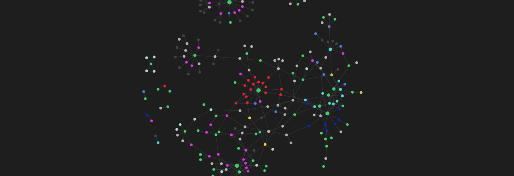

---

Tech companies do know more about you than you know yourself. If that is unsettling, good, keep reading. These are practical ways to take back some control without turning it into a full-time project.

---

# Passwords

The most common way a digital life unravels is password reuse. One breached service hands anyone with the data access to every other service that uses the same credentials. It happens constantly and most people do not notice until something goes wrong.

The fix is a password manager. Not "remembering a strong password for each site" — that fails at scale. A dedicated tool that generates, stores, and fills unique passwords so you never reuse one.

Two worth knowing:

- **Bitwarden**: free, open source, works on every platform and browser. The default recommendation for most people.
- **1Password**: paid, better UX, worth the cost if you want something more polished. Good shared vaults for families or small teams.

Once you have one, the workflow is simple: the manager generates a random password for each new account, saves it, and fills it next time you log in. You only need to remember one strong master password.

Browser-built-in password managers (Chrome, Safari, Firefox) are better than nothing but have one weakness: if someone accesses your browser session, they get your passwords too. A separate app adds an independent lock.

<br>

---

# Email (Gmail)

Your email address is your primary digital identifier. How you manage it determines a lot of what ends up in your inbox and what gets exposed when a service has a breach.

## Plus Sign Variations

Gmail treats `username+anything@gmail.com` as the same address as `username@gmail.com`. You can add any tag after the `+` and all mail still arrives in your inbox.

```
username+work@gmail.com
username+shopping@gmail.com
username+newsletters@gmail.com
```

The useful part: you can create a filter that automatically labels any email sent to `username+shopping` as "Shopping" and skips the inbox. It also tells you which service sold your address — if you signed up to a store with `+shopping` and start getting spam to that exact address, you know where it came from.

## Labels and Filters

Labels are more useful as a filing system than as color-coding. The real power is combining them with filters so emails get sorted automatically when they arrive.

A filter that works well for receipts:

```
From: (noreply@amazon.com OR orders@apple.com)
→ Apply label: Shopping/Receipts
→ Skip inbox
```

Nested labels keep things readable: `Work/HR`, `Work/Receipts`, `Personal/Banking`. You can then search with `label:work/receipts` and get exactly what you need without digging through your inbox.

## Unsubscribing vs. Filtering

Filters hide noise. Unsubscribing removes it. If you find yourself adding filters for promotional emails, unsubscribe from them instead. The filter approach is maintenance you have to keep up forever. The unsubscribe is a one-time action.

Gmail shows a built-in unsubscribe link at the top of most promotional emails — that is the safest route. Be careful with unsubscribe links in emails from senders you do not recognize. Some are phishing attempts that confirm your address is active.

## Account Separation

Using one address for everything means one breach exposes everything. A minimal separation that helps:

- One address for people you know personally.
- One address for online services, shopping, and signups.
- A disposable alias (via SimpleLogin, or just a second Gmail account) for one-time signups you do not expect a relationship with.

When the shopping address starts getting spam, you can deal with it without touching the address you give to people.

## Security

In rough order of impact:

- Two-factor authentication on everything, especially email and anything financial. Use an authenticator app (Google Authenticator, Authy) rather than SMS — SMS codes can be intercepted.
- Review connected apps in your Google account settings every few months. Remove anything you no longer use. Old integrations are a forgotten attack surface.
- Set recovery options: a backup email address and a phone number. You will need these exactly once and be very glad they were set.

<br>

---

# Notifications

Most apps should not be able to interrupt you. The default answer for every notification permission request is no. You can always enable it if you find you need it. You almost never find you need it.

A useful split:

- **Allow**: calls, messages from people you know, calendar reminders, banking alerts. Things that are time-sensitive and require a response.
- **Check on your schedule**: email, Slack, social media, news. These can wait for a dedicated check. Being interrupted by them constantly does not make you faster, it just fragments your attention.
- **Disable entirely**: promotional apps, games, most social platforms. These are designed to pull you back in, not to inform you of anything useful.

Do Not Disturb on a schedule (e.g., 10 PM to 8 AM) removes the temptation to check late at night. On iPhone and Android you can set exceptions for specific contacts so real emergencies still reach you.

The goal is to check things on your schedule, not be summoned whenever an app wants your attention.

<br>

---

# Browser

## Profiles for Work and Personal

Browser profiles are the most underused organization tool for anyone who mixes work and personal browsing on the same machine. A profile is a separate browser instance with its own bookmarks, extensions, logged-in accounts, and history.

One profile for work, one for personal. The work profile has your work Google account, work tools, and work extensions. The personal profile has everything else. Closing the work profile at the end of the day creates a clean boundary that a single browser with multiple tabs does not.

Concrete benefits: no more accidentally posting from the wrong account, no cross-contamination between work and personal search history, and work-specific extensions (like VPN or internal tools) stay out of your personal browsing.

In Chrome, Edge, and Firefox: click your profile icon in the top right to create a new one.

## Tab Management

A browser with 40 open tabs is not organization, it is avoidance. Each open tab is a deferred decision.

Two rules that help:

- If you are keeping a tab open to read later, move it to a read-later app (Pocket, Readwise Reader) and close it. It will not get read while it is a tab either.
- If you are keeping a tab open as a reference, bookmark it in a named folder or put it in your notes. Then close it.

Reviewing and closing tabs at the end of the day takes less than five minutes and makes the next morning less overwhelming.

## Useful Extensions

- **uBlock Origin**: ad and tracker blocking. Not just about ads — pages load faster and a significant amount of cross-site tracking stops. Install this first.
- **Bitwarden** (or your password manager of choice): fills passwords in the browser. One less reason to reuse them.

More than two or three extensions adds overhead and can slow the browser down. Keep it minimal.

<br>

---

# Files and Storage

## File Naming

The habit that pays off most over time: prefix every file with the date in `YYYY-MM-DD` format.

```
2025-02-21 contract draft.pdf
2025-01-15 architecture review notes.md
2024-12-03 tax return.pdf
```

Files named this way sort chronologically by default in every file system. Six months later you can find the right version without opening five files with names like `Contract FINAL (2).pdf`.

## Folder Structure

Three top-level folders cover most use cases:

- **Projects**: active work you are currently on
- **Reference**: things you consult but are not actively producing (documentation, templates, guides)
- **Archive**: finished projects, old versions, anything you might need someday but are not using now

Moving a finished project to Archive keeps your active workspace from accumulating clutter. The rule: if you have not opened a folder in three months and it is not Reference material, it goes to Archive.

## Backups

The minimum backup setup: your files exist in at least two places at all times, with one of them offsite.

In practice for most people: files on your machine, synced automatically to cloud storage (Google Drive, iCloud, Dropbox), and an occasional copy to an external drive for anything irreplaceable. The cloud protects you from hardware failure. The external drive protects you from a compromised or locked cloud account.

Photos deserve a specific mention: a phone full of photos with no backup is one dropped phone away from losing years of content. iCloud Photos, Google Photos, or a manual export to an external drive — pick one and make it automatic.

<br>

---

# Calendar

A calendar that only shows meetings is a list of interruptions with a time display.

## Block Time for Real Work

If a task needs focused time, put it on the calendar. If it is not blocked, it will get scheduled over. A two-hour block labeled "architecture doc" or "sprint planning prep" is not an aesthetic choice — it is how you protect the time for work that requires concentration and does not come with an invite.

Treat your own blocks the same way you treat external meetings. Rescheduling them is fine. Silently letting them get overwritten is not.

## Color Coding

A visual distinction between meeting time and work time makes it immediately obvious when a week is meeting-heavy before it happens. A simple split: one color for meetings, another for focus blocks, another for personal commitments. Three colors is usually enough.

## Buffer Between Meetings

Back-to-back meetings feel efficient on paper. They are not. The 15 minutes between meetings is when you write the follow-up message, process what was just decided, and switch contexts before the next conversation. Without it, meetings blur together and actions fall through.

If your calendar fills up with consecutive meetings regularly, the useful question is which of them actually needed to be a meeting.

## Weekly Review

A 15-minute block at the end of Friday to look at next week's calendar: confirm focus blocks are still there, move anything that shifted, and check whether the week as planned is realistic. This prevents the gradual erosion of protected time by scheduling drift.

<br>

---

# Social Presence

What shows up when someone searches your name is not entirely in your control, but it is worth being deliberate about what you put there.

## Usernames

Consistent usernames across platforms make it easier for the right people to find you. Variations for accounts you want to keep separate from your professional identity are also useful — the tradeoff is obvious: consistent means searchable, which is good professionally and less so for anything you want to keep quiet.

## LinkedIn

LinkedIn is more useful as a living record of your work than as something you update only when job hunting. A profile that is current means you are not writing your professional history from memory under pressure when you actually need it.

The things worth keeping current: your current role and a brief description of what you actually do, not just your title. Recent projects or outcomes, if you can describe them publicly. Skills that reflect what you actually want to do next, not just what you have done.

## GitHub

A GitHub profile is read by more people than most engineers expect. A clean profile does not need to be impressive — it needs to be legible.

Pinned repositories should be things you would actually want to show someone. A README on your profile (create a repository with the same name as your username) is a low-effort way to add context about what you work on and what you are interested in. The bar is low: even a few sentences is better than the default empty state.

## One Link

Whether you use Linktree, Carrd, or just a GitHub README, having one URL you can give someone that points to everything relevant is useful for any situation where you want to make it easy to find you. Keep what is at the top aligned with your current goal — a job seeker and someone promoting a side project should have different things at the top of the list.
