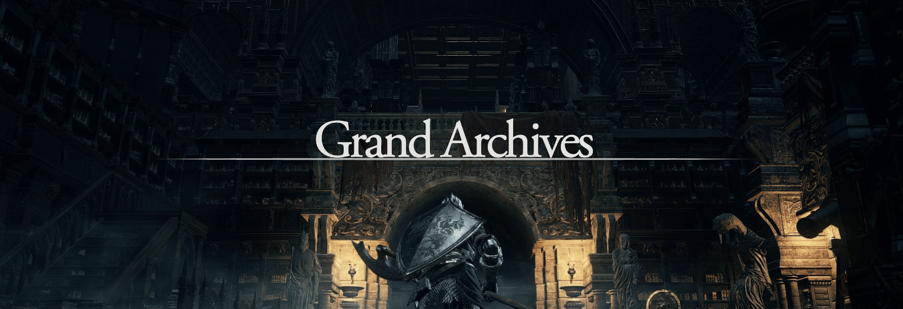

  <a href="/pages/ds-interviews" class="ds-button left-button"><strong>Go Back to Home</strong></a>
  <a href="/pages/ds-interviews-chapter-1" class="ds-button right-button"><strong>Go to Chapter 1</strong></a>

---

Usually, you would only worry about this once you're deep into the game, but sometimes knowing the options will lead to better mental health.

⚠️ Spoilers: Since I’m revealing a lot of techniques and secrets, I’ve decided to make it Dark Souls-themed. 

# Single Player

In this mode, you're on your own to find a match. You must traverse through random and questionable pages to land on one where a boss fight can be possible. 

It's tricky at first, but when you win, the benefit is that you can negotiate better rewards and positioning. This freedom often comes with more leverage in the long run, especially if you align yourself with a Covenant later.

# Covenants

When you join Covenant, you get more frequent matches and interview opportunities. However, this comes at a cost: a cut from the rewards you would otherwise receive working directly.

It's a 50/50 scenario. Sometimes, you won't get the same opportunities as someone going single-player, and it's often advised not to grind your way up from the bottom in a Covenant. Switching from a better position in a single-player or another Covenant (not too frequently) can lead to better results.

## Benefits

- **Worlds Available:** you get more stuff
  - This can be potentiated by knowing languages like English (If it isn't your primary language). 
- **Vouchers and Discounts:** Some Covenants will refund or cover certifications (spells) you acquire. However, with a reduced reward cut, you might've been able to pay for the certifications yourself.
- **Training:** You can learn from more experienced players through associations or other members.
- **Help Network:** You're not alone, and while you can't summon a ghost for every fight, you will have help when needed for different worlds.

## Additional Conditions

- **Extra Side Missions:** You'll have extra tasks outside your regular work, like gathering items, slaying demons (read: tedious tasks), or preparing presentations for other members.
- **Additional Menus:** Covenants come with more tools but also more complexity. Metrics and additional responsibilities come into play, making it harder to balance.
  

## Opposite Covenants

Now, there's a risky mechanic that's technically not illegal but frowned upon: swapping between rival Covenants. The tech work it is huge, so multiple covenants playing in the same worlds is not a weird scene, but sometimes things get a little tense, and that leads to "interesting" opportunities by just moving.

Keep the following in mind:

- You might get shadow banned from other words through their link with the Covenants.
  - Even if you work around the usual restrictions, like moving to a single-player, finding a match, and then joining the rival Covenant, you're still at risk.
- The upfront rewards are excellent, but after that, they are the same as any covenant.
- It's a shady move.
- Additional things to consider:
  - What happens when you don't have a match?
  - How much control do you have over the Covenant's requirements?

Ultimately, how you play this is up to you, but tread carefully. If you've been with a Covenant for a couple of years, haven't gained any new levels, and haven't seen any bonuses in your rewards, it might be time to reconsider your options. 

Some people are just in it to make a quick buck, which usually leads to them getting caught up in Covenant fights. These "opportunities" often promise something enticing about the world you're heading into but deliver something else entirely. In reality, the goal was more about weakening the rival Covenant than actually acquiring you. By extension, this can damage the world and landscape you're part of, reducing the number of players and throwing everything into disarray.

If that affects your position and has to be thrown somewhere else, that's how things will become. 

It's a risky play that can mess things up not just for you but for everyone involved.

# Multi-Accounts

Some may claim that farming two companies simultaneously (multi-accounting) is better than being part of a single Covenant. In theory, you could earn more rewards with the same energy spent on side-quests.

It's controversial. It's up to you.

If you half-ass two things, you may get better rewards but need to level up more. But that's my mentality: level up and overpower most things.

For someone who wants to keep a steady rhythm after a certain point and doesn't care about climbing the corporate ladder or developing themselves through the pain of maxing the skill trees, the multi-account makes a lot of sense.

There is also the mental health aspect, but I'm not here to preach about that; everyone has their own circumstances; maybe you have reasons to do it and can keep a good pace in both places without affecting your respective teams and deliverables. If that's your case, good for you!

---

  <a href="/pages/ds-interviews-chapter-1" class="ds-button right-button"><strong>Continue to Chapter 1</strong></a>

