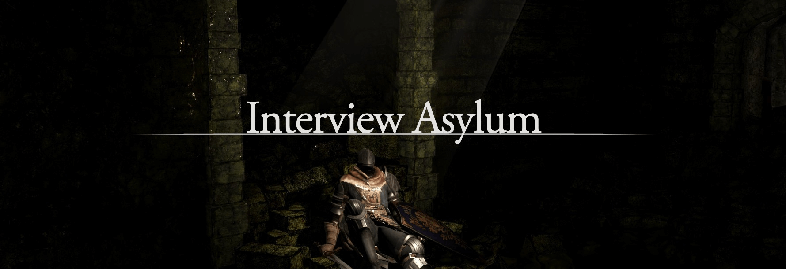
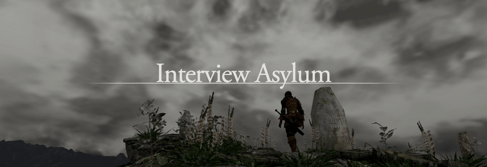

---

<a href="/pages/ds-interviews" class="button fork"><strong>Return</strong></a>

---

---

---

# Preparation Bonfire

Yup, not so fast to the boss fight. We need to gather a few essential items before pushing forward. The good news? These items improve with time, but you’ll need them in your inventory to stand a chance.

You might be one of the hardcore ones, breezing through everything with 0% damage. But for the rest of us mere mortals, proper preparations are essential.

 

## Work Experience Over General Knowledge

Hands-on experience with tools is more valuable than theoretical knowledge. By the time you reach the mid-level (Ssr), you’re expected to know the essentials—this is the baseline.

Do we have here some General knowledge questions? Those are a separate challenge. But don’t worry. We’ve covered you with the [Interview Preparation](#interview-preparation) section to give you a glimpse of the critical topics.

 

## Certifications are Good, But...

They’re mostly just a way to skip the easy questions in interviews, but if you play your cards right, they can serve as leverage to claim even greater rewards.

- It’s tough for those who’ve put in a serious effort to get certified. Still, all a certification tells me is that you have time to study, a good memory, and probably a Cloud Guru subscription or whatever young ones use these days.
- Certifications can even backfire. That’s why I only certify in technologies I’m actively working with and have enough hands-on experience to support. Otherwise, it’s just cramming knowledge.
- If your approach is, “I want to dive deeper into X technology, and I’m using this certification as a challenge to find a related job,” that’s valid, too.

In short, if the certification supports your build, great! Otherwise, it’s like being a Strength build and wasting early points on learning a spell you can barely cast, leaving you open to attacks instead of focusing on fortifying your core skills.

 

## Accents

Since you're reading this, I assume you're comfortable with written and spoken English, which is safe. However, many underestimate the challenge of understanding everyday speech, especially from people who aren't native speakers.

A few takeaways:

- In tutorial videos, people often speak at a perfect pace and enunciate clearly. But in real life, it's common to encounter native speakers who mumble, rush through sentences, or use slang.
- You'll work with people worldwide, and only some people care about flawless grammar or polished speech as long as they can convey their message.
- Clients from other countries are patient and understanding with non-native speakers. So don't stress over it, you will **git gud**.
  - If you find some weird case... well It will make you stronger.

 

## Communication

Clear Communication is Crucial whether in interviews or building relationships with clients, the ability to explain your ideas is not just a must but a significant factor in your professional success. Preparation is your Estus Flask—it will keep you going. While there will come a time when you'll breeze through interviews, preparation is key until then.

With this in mind, at least you won’t stumble right out of the fog gate, giving off the wrong impression.

 
---

---
 

# Practice Grounds

For this section, we’ll dive into the general attack patterns and how to counter them. Honestly, it’s just dodging and hitting—how hard can it be, right?

## Inspiration Sources

Behavior and other patterns not directly related to combat.

 

## Enemies Moveset

  

    
<strong>Tell me about your experience</strong>

    <ul>
      <li>The interviewer wants to know about your experience. Briefly mention the technologies and projects you’ve worked on.</li>
      <li>Prepare this beforehand, focusing on what they might want to hear and highlighting your key achievements.</li>
    </ul>
  

  

    
<strong>What’s your level with X technology?</strong>

    <ul>
      <li>Your answer sets the difficulty of the questions. A safe option is “intermediate” if you’re unsure, but “advanced” or “expert” works if you have deep experience.</li>
      <li>Expect a more engaging conversation when both parties have high levels of knowledge.</li>
    </ul>
  

  

    
<strong>In this hypothetical scenario, how would you accomplish it?</strong>

    <ul>
      <li>This question aims to assess your understanding of architectures, workflows, and tools.</li>
      <li>You may not have direct experience, but knowing which tools are best is key. Multiple answers are common, so stick to what you’re confident with.</li>
      <li>They may challenge your answers to see how you react and adapt.</li>
    </ul>
  

  

    
<strong>Architecture types</strong>

    <ul>
      <li>At this level, you should be familiar with various architectures like microservices, monoliths, and event-driven systems, and know when each is appropriate.</li>
      <li>Expect questions like “What challenges would you face when using a microservice architecture from scratch?”</li>
    </ul>
  

  

    
<strong>What are the projects you have worked on?</strong>

    <ul>
      <li>The interviewer wants to see your hands-on experience. Be prepared to dive into the details of your most challenging projects.</li>
      <li>Highlight popular technologies to earn more points and steer follow-up questions.</li>
    </ul>
  

  

    
<strong>Cloud Provider Knowledge</strong>

    <ul>
      <li>Expect questions on VPC setup, Load Balancers, security best practices, and specific service knowledge (CloudFront, Lambda, SQS, etc.).</li>
      <li>Prepare for database-related questions: backups, configuration, and general use cases.</li>
    </ul>
  

  

    
<strong>Containers</strong>

    <ul>
      <li>Be ready for Docker and Kubernetes questions, including common commands, troubleshooting, service mesh, and Helm knowledge.</li>
    </ul>
  

  

    
<strong>Pipelines</strong>

    <ul>
      <li>Know how to automate everyday tasks, manage dependencies, and improve job speeds.</li>
      <li>Understand good practices around CI/CD pipelines.</li>
    </ul>
  

  

    
<strong>Automation IaC</strong>

    <ul>
      <li>Prepare for specific questions around Terraform (e.g., state locking, merging maps) and CloudFormation, including SAM and Serverless Framework.</li>
    </ul>
  

  

    
<strong>Automation Configuration Management</strong>

    <ul>
      <li>Expect questions about tools like Packer, Chef, and Ansible, and their differences.</li>
    </ul>
  

  

    
<strong>Security</strong>

    <ul>
      <li>“Do it with security in mind” applies to everything above.</li>
    </ul>
  

 

 

---

<a href="/pages/ds-interviews-chapter-2" class="button fork"><strong>Chapter 2</strong></a>

---



<!-- Single Modal -->

  &times;
  

<!-- JavaScript for Modal Functionality -->


