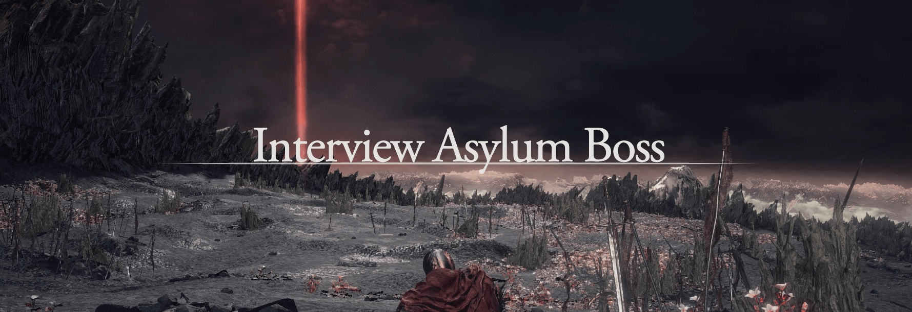

<a href="/pages/ds-interviews-chapter-2" class="button fork"><strong>Return to Chapter 2</strong></a>

---

---

---

 

# Senior Interview Boss Fight

## First Phase

After the pleasantries, meet each other and explain a little about yourself. Usually, the interviewer will describe the technologies they are looking for and what they use, setting the tone. Or it can be at the end after testing you against some questions or after you talk about yourself. Therefore, you will find the common scenarios below based on my experience.

- **Rarely**: the interviewer starts from scratch, asking straightforward questions and increasing the difficulty slowly or based on your answers. It rarely happens because you require the meeting to be one hour long, which averages 30 minutes.
- **Sometimes**: the interviewer starts asking questions about the technologies it uses, expecting a similar level to him or decent answers. I like this type of interview because it’s faster and you can learn much from it.
- **Usually**: the interviewer asks you about your experience and questions based on what you tell him to dimension your level/skills. Of course, this applies if your knowledge matches 50-70 percent at least on what they do. It’s more challenging to interrogate someone on something the interviewer doesn’t work with—for example, a different Cloud Provider. If they are still willing to listen, common ground can be made based on similar approaches like troubleshooting, network configs, etc.

## Second Phase

Now that you are getting comfier, the nerves are calming, and the interviewer knows what you have to offer, the things below can happen.

- If the structured story of your experience were catching enough, the interviewer would be on the path to ask you about what you expect! Otherwise, improvise; you did all that you could. Congrats!
- An example of questions will be at the end. (Eventually)
  - I won’t go deep on those because they depend on your experience, the client's expectations, and the positions you are applying for.

## Bonus Phase: Feeling

Often ignored, people sometimes say, “yeah, I would like to work with him” or “I like him,” and that’s enough. So if you are not charismatic like me, check the points below.

- Interviewers look at and evaluate how people respond to things.
  - Internal questions like “How did he react when he didn’t understand or couldn’t respond,” “He missed the question and didn’t want to admit it,” or “Did he resist the pressure?”
- Easy to overlook, but companies are searching for a person to work with, and with the interview, they get a glance at the person’s character, and they will be stuck with you for a long time. It’s not about being a liability. It’s about not making things harder for others.
  - If you take minutes to answer simple questions or similar, don’t go anywhere when trying to answer, that’s a pretty good message to interviewers on how you are working.
- The engagement can make a difference, especially if the interviewer is the person you will be working with. If you don’t know, that’s okay. Depending on the interviewer, they will be willing to listen to you to get to the answer or something near. You can recover some points by explaining your reasoning and including him in the conversation.
  - It’s not about quitting before answering. It’s to try to figure it out. You will often get with clients and app owners, and they will expect a satisfactory answer in a short amount of time. There are tricks to handle that, but that’s sold separately.
  - But if you are stuck, be upfront of it but not with the intention of running.
- Troubleshooting is an essential skill. Finding a piece of code that does the trick we need is easier, but resolving issues specific to the company’s scenario is not easy.
  - Of course! Stackoverflow can save you from various things, but when you are stuck on a call against the clock and the issue is not common, you will see how much you understand how things work.
  - An old coworker told me, “Our jobs can be done through scripts and thus automated. We get paid because we can solve problems and our capacity to troubleshoot and adapt to new issues.” Or something like that. The story's moral is that when we resolve issues (complex) or architectural challenges, we show our way of thinking and how we handle ourselves.

## End Phase

At this point, the interview concludes, and the interviewer will tell you the next steps or close the door in your face. In any case, everything is a learning experience.

Depending on how you get the interview you may get feedback, by a third-party or by people of the same company.

// Will add some tips later
// Rejection path
// Acceptance path
// Internal challenges

---

<a href="/pages/ds-interviews" class="button fork"><strong>Main Page</strong></a>

---



<!-- Single Modal -->

  &times;
  

<!-- JavaScript for Modal Functionality -->


