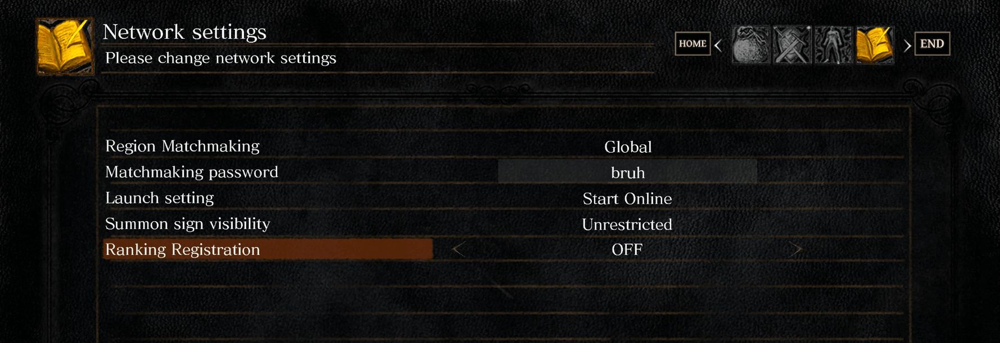



---

---

Congrats! You now have become the monster you swear to destroy.

# Types of Candidates

In this mod

# Attack Patterns

When you join Covenant, you get more frequent matches and interview opportunities. However, this comes at a cost: a cut from the rewards you would otherwise receive working directly.

It's a 50/50 scenario. Sometimes, you won't get the same opportunities as someone going single-player, and it's often advised not to grind your way up from the bottom in a Covenant. Switching from a better position in a single-player or another Covenant (not too frequently) can lead to better results.

## Agro

- **Extra Side Missions:** You'll have extra tasks outside your regular work, like gathering items, slaying demons (read: tedious tasks), or preparing presentations for other members.
- **Additional Menus:** Covenants come with more tools but also more complexity. Metrics and additional responsibilities come into play, making it harder to balance.

---


