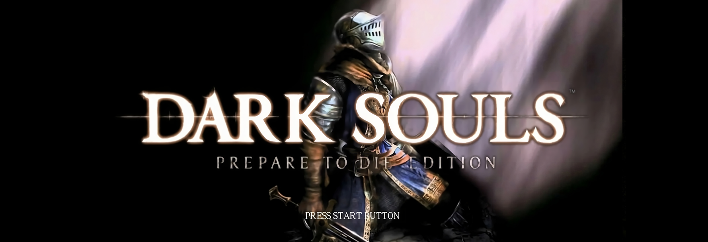

~~This Mini Book is for DevOps and Cloud Engineers leveling up from Semi-Senior Advanced to Senior roles.~~

I originally started writing this to help Cloud/DevOps/SRE Semi-Seniors to advance to Senior roles. I found myself repeatedly sharing the same practical advice, so summarizing everything made sense.

As a fun touch, I styled this like a Dark Souls playthrough guide. Of course, that led to me diverting my attention and delving into multiple topics beyond just interviews.

The references might be confusing for some, and for others, they may be helpful as an analogy. In any case, I understand that this may be a bit overwhelming, but I hope this helps you in some way!

<!-- https://darksouls.wiki.fextralife.com/Dark+Souls+Remastered -->

---

---

- [Chapter 0: Game Modes](/pages/ds-interviews-chapter-0): optional content, to talk a little bit about ~~companies~~ covenants.
- [Chapter 1: Setting Your Character](/pages/ds-interviews-chapter-1): customization and types of builds.
- [Chapter 2: Preparation Bonfire](/pages/ds-interviews-chapter-2):
- [Chapter 2.5: Grand Archives](/pages/ds-interviews-chapter-1.5): optional content to get more experience and preparation. 
- [Chapter 3: Boss Fight](/pages/ds-interviews-chapter-3):

---

  <a href="/pages/ds-interviews-chapter-0" class="ds-button right-button"><strong>Go to Chapter 0</strong></a>

  <a href="/pages/ds-interviews-chapter-1" class="ds-button right-button"><strong>Go to Chapter 1</strong></a>

