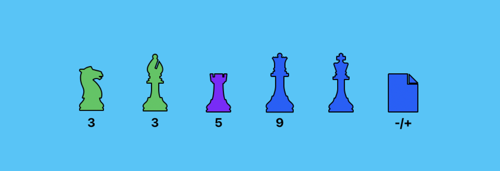

<div class="nav-buttons">
  <a href="/pages/jira" class="custom-button right"><strong>Menu</strong></a>
  <a href="/pages/jira-chapter-2" class="custom-button left"><strong>Chapter 2</strong></a>
</div>

---



---

# JQL General


# In Progress Tickets

This would be useful to get what you currently are working:

```
PROJECT = "EHQ" AND assignee IN ("luciano@ehq.cl") AND status = "In Progress" ORDER BY status DESC, updated DESC      
```

But it could be improved by adding a limiter based on the updates:


This could prevent getting results that are not getting actively updated.


# Work that hasn't been completed yet


```
PROJECT = EHQ AND assignee IN ("luciano.ehq.cl") AND status NOT IN (Closed, Done, "In Progress", "Resolved", "Withdrawn") ORDER BY status DESC, updated DESC
```


<br>


---

<div class="nav-buttons">
  <a href="/pages/jira" class="custom-button right"><strong>Menu</strong></a>
</div>
<a href="/pages/jira-chapter-2" class="custom-button right"><strong>Chapter 2</strong></a>
