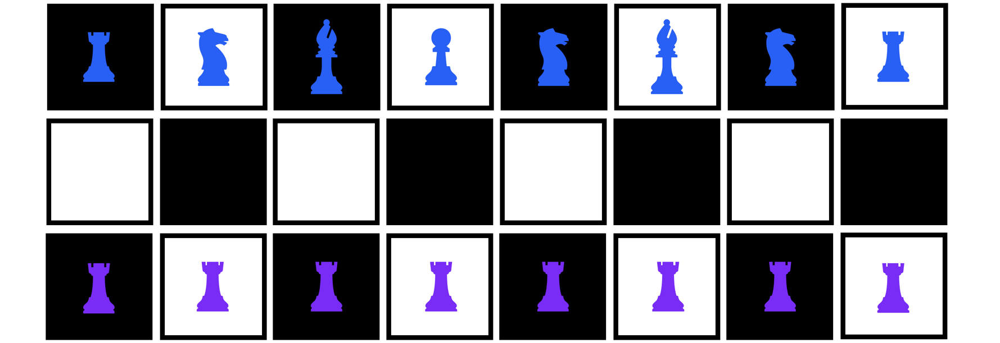

> The Business is not as forgiving as I am -  Darth Manager

---

# How This Mini-Book Can Help You

Figuring how to make your workers a metric seems simple and badhearted, but it isn't simple at all, but it's not just as easy as it sounds. For work reasons I had to come up with something that could help us identify all groups that contained multiple people, from different projects... and well, this already goes beyond to "my three squads metrics"

A good system can track and locate where we are wasting efforts. I'm all down for it, I like the concept of transparency even if that is a double edge sword.

Yes, with this, they can know where are you located in an ocean of teams, and what when and where are you doing things.

---

# Chapters Overview

I'll structure this in a friendly manner:

- [Chapter 1: JQL](/pages/jira-chapter-1.md): 
- [Chapter 2: Integrations](/pages/jira-chapter-2.md): 
- [Chapter 2.5: Spreadsheets](/pages/jira-chapter-2.md): 

---

  <a href="/index" class="custom-button right"><strong>Main Page</strong></a>
  <a href="/pages/jira-chapter-1" class="custom-button left"><strong>Chapter 1</strong></a>

<a href="/pages/jira-chapter-2" class="custom-button right"><strong>Chapter 1.5</strong></a>
