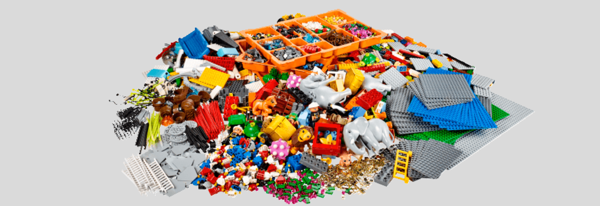

  <a href="/pages/lsp-chapter-2" class="custom-button right"><strong>Chapter 2</strong></a>
  <a href="/pages/lsp-chapter-4" class="custom-button left"><strong>Chapter 4</strong></a>

---

---

 

# LEGO Kits

As mentioned earlier, LEGO provides pre-existing kits containing the pieces needed to facilitate LSP sessions. Here's a quick summary of the kits:

| Kit                        | Product ID | Pieces |Purpose                     | Price (USD)       | Dimensions (CM)  | Weight (KG)  |
|------------------------------|------------|--------------------------|-------------|-------------|----------|
| **Window Exploration Bag**       | [#2000409](https://www.lego.com/en-us/product/window-exploration-bag-2000409)  | [49](https://www.bricklink.com/v2/catalog/catalogitem.page?S=2000409-2&#T=I)| Short Activities         | 484.99 | 49x30x30 | 6 |
| **Starter**                  | [#2000414](https://www.lego.com/es-us/product/starter-kit-2000414) | [234](https://www.bricklink.com/v2/catalog/catalogitem.page?S=2000414-4#T=I)  | Get Serious      |  36.99 |32x24x7  | 1|
| **Identity and Landscape**   | [#2000430](https://www.lego.com/en-us/product/identity-and-landscape-kit-2000430) | [2802](https://www.bricklink.com/v2/catalog/catalogitem.page?S=2000430-2#T=I)  | Live Serious  | 789.99  | 67x48x8  | 8      |
| **Connections**              | [#2000431](https://www.lego.com/en-us/product/connections-kit-2000431)  | [2455](https://www.bricklink.com/v2/catalog/catalogitem.page?S=2000431-1#T=I)  | Live Fast and Serious  | 754.99  |48x35x9 | 6  |

How and where use each kit and the amount it's part of the training, but keep in mind it will be expensive.

 

## Replacement Options

You can surely use used LEGO, outside of my collection I have over 90 pounds of it. **But** it probably won't be enough, here are the reasons:

- **Damage**: Used pieces can be worn, chipped, or discolored.
  - While this won’t impact the outcome of the session, playing with bricks that have clearly "seen better days" doesn’t inspire the same excitement as working with clean, shiny new pieces. 
- **Consistency**: Some "common" pieces are surprisingly rare.
  - For example: Windshields and firetruck stairs. Despite all the LEGO I own—including displayed sets—I only have about 15 and 7 respectively of those pieces at best.
      - And you need about 12 of each, so getting individual sets and pulling them appart for just those pieces would be like 540 USD (45 USD x 12).
      - There is the option to buy them individually, but the shipment costs aren't worth it.
- **Special Pieces**:
  - The Connections Kit is a gold mine. You won't get the same amount of technic pieces anywhere else.

And what about the unbranded Kits? Well, it depends:

- **Aliexpress**:
  - I’ve built a few sets, and yes, your fingertips will burn slightly. A Reddit comment warned about this, and it’s true—it’s the paint.
  - Some pieces fade after cleaning.
  - Quality is not the same. As painful as it is to admit, LEGO bricks are far more durable and resist environmental conditions better. So it may be cheaper but it won't last.

- **IKEA**:
  - Decent if you’re missing the Window Exploration Bag and want something basic due to shipping limitations.
    - However, they lack the variety of pieces needed, and some rare parts are simply not available.

 

## Maintenance

Sooner or later, you’ll need to clean your LEGO pieces. When you’re working with 10+ kilograms, efficiency is key.

Recommended Method:

- Use mild soap.
- Place bricks in a mesh laundry bag to avoid losing pieces while cleaning or ruining your laundry machine.

## Session Materials

- **Post-Its**: Essential for longer workshops. Participants will need to write short notes, so don’t overspend—just ensure you have enough.
- **Music**: a speaker may help to to the ambience sound. [Everything Has to Be a Montage](https://youtu.be/YoxIQ2HCco8?si=pAT5oMQFbh4nZ-j8&t=20).
  - Since my music taste might not work for everyone, here are a few options you can try instead:
    - [𓆜 | playlist to be a shark](https://www.youtube.com/watch?v=7avPoMhQxX8&ab_channel=blewoo).
    - [La mejor música de elevador o ascensor instrumental relajante lounge](https://www.youtube.com/watch?v=0Akp1v6QrYA&ab_channel=LiveBetterMedia-Espa%C3%B1ol).
    - I'll figure better playlist/songs eventually...
- **Camera**: you don't need a expensive camera, but it makes the difference if you want to capture all objects rather than just a few and the rest blurred.
  - Remember to ask for permission before taking pictures of anyone involved!

 

# Buying LEGO Kits

If you live in the [best and first country of Chile](https://www.youtube.com/watch?v=61hqRtsIXDM&ab_channel=Tetuaje), congrats! But brace yourself—it’s going to be expensive.

To buy directly from the[LEGO Store](https://www.lego.com/es-us), you’ll need one of these methods:

- **Direct Shipping**: Not an option. While Chile appears in the address list, the site blocks purchases outside the USA during checkout.
- [Casilla Correos (P.O. Box Service)](https://casillainternacional.com/): Reliable but expensive.
- [Comparto Mi maleta](https://compartomimaleta.com/): Haven’t tested it myself.
- [Amazon JP](https://amazon.co.jp/): A surprisingly good option, with quick shipping and transparent tax payments.

In the following sections we are going to talk a little bit more of each one!

 

## Amazon JP

You can only get the **LEGO Starter Kit**, but it will arrive quickly and no cumbersome process to pay taxes and all, as the AMAZON.COM it will show you what you will pay.

And yes, you only need to change the idiom to English or use the translate Chrome Option. 

**Steps to Buy**: 

- Make sure the "Ships from" section includes Amazon (see example here). This ensures the package will be shipped via DHL.
  - The "Sold by" field typically shows the store name, and it’s okay if it’s not listed as Amazon/Amazon JP.
  - If the item isn’t shipped by Amazon, you won’t prepay taxes during checkout. Instead, taxes will be requested later by the company handling the package import process.
- Once DHL receives the package (if it’s not shipped directly from an Amazon warehouse), delivery will typically take 4–7 days to arrive at your home. Yes, it’s that efficient.
- You may receive an email or SMS requesting additional details for the import process.
  - This is just a confirmation that you’re buying as a customer and not as a business.

 

## Comparto Mi Maleta

People post their available travel ranges, and you can calculate costs based on their schedules and availability.

- You can request a quote from multiple travelers, but keep in mind they may reject your request if it doesn’t align with their plans.
  - Think of it like Tinder... but for packages.
  - This system allows you to compare and select the best deal.
- Once your package arrives in Chile, you can choose to pick it up directly from the Comparto Mi Maleta office or arrange the delivery.

 

## Casilla Internacional (P.O. Box Service)

There is a lot to cover, but to keep it simple, here is the summary:

  - **Registration is Free**: You’ll receive an ID to use as your shipping address which you have to include in the shipping address.
  - **Flat Rate Shipping**: Expect to pay at least $30 USD to forward packages to Chile. Larger items like LSP kits cost significantly more.
  - **Reliability**: The good part? Your package will almost certainly arrive, and you can follow up directly with the service if something goes wrong.
  - **Timing**: Once it arrives in Miami, shipping to Chile takes 3–4 weeks. Shipments usually leave on Thursdays, so plan accordingly.

**Steps to Buy**: 

- Add your [Casilla address](https://casillainternacional.com/CLAyuda.aspx) to the LEGO Store. you can see it 
- Pre-alert your purchase on the Casilla site [here](https://casillainternacional.com/PBOXCASILLA/ifprealerta_nous.aspx).
- Use their [Price Calculator](https://casillainternacional.com/tarifas_calculadora.aspx) to estimate costs.
- Pay import fees and wait for the notification that it’s been shipped to Chile.
- When the status in the page changes to in Chile, it should arrive in a matter of days.

 

---

  <a href="/pages/lsp-chapter-2" class="custom-button right"><strong>Chapter 2</strong></a>
  <a href="/pages/lsp-chapter-4" class="custom-button left"><strong>Chapter 4</strong></a>

