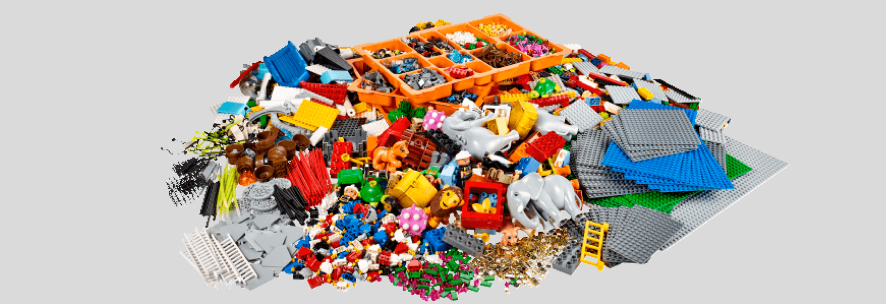

  <a href="/pages/markdown" class="custom-button right"><strong>Home</strong></a>
  <a href="/pages/markdown-chapter-1" class="custom-button left"><strong>Chapter 1</strong></a>

---

---

 

# Templates

# Domain

# Other respositories

---

  <a href="/pages/lsp-chapter-2" class="custom-button right"><strong>Chapter 2</strong></a>
  <a href="/pages/lsp-chapter-4" class="custom-button left"><strong>Chapter 4</strong></a>

