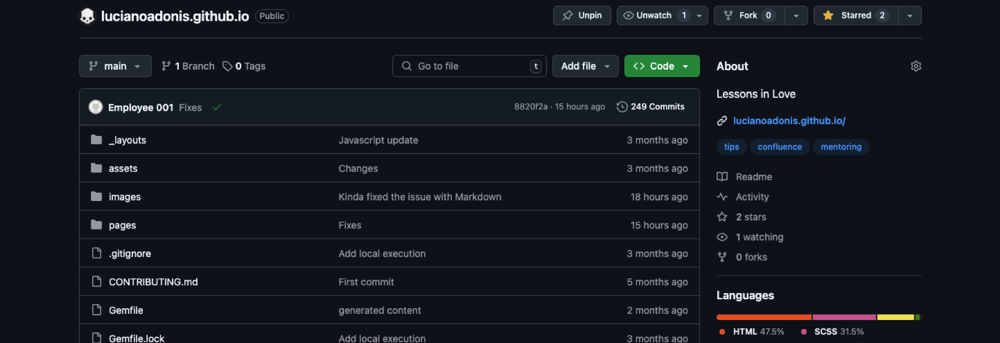

<div class="nav-buttons">
  <a href="/pages/markdown" class="custom-button right"><strong>Menu</strong></a>
  <a href="/pages/markdown-chapter-2" class="custom-button left"><strong>Chapter 2</strong></a>
</div>

---



---

<br>

# Templates

In this [page](https://pages.github.com/themes/) you can get the list of available themes and their repositories.

If you want to customize you will need to look the repository to overwrite them.

<br>

# Structure

To use other layout or make changes to the existent one, make a copy from the original repository and do the proper changes.

Then place it under:

```bash
.
└── yoursite.github.io/
    ├── _layouts/
    │   ├── custom.html
    │   └── default.html
    ├── assets/
    │   └── css/
    │       └── style.scss
    ├── images/
    ├── pages/
    │   ├── a.md
    │   ├── b.md
    │   └── c.md
    ├── _config.yml
    ├── favicon.ico
    └── index.md
```

<br>

# Layout

Continuing the Leap Day example you can get the file from the _layouts folder right [here](https://github.com/pages-themes/leap-day/blob/master/_layouts/default.html).

Sometimes it's easier to look what you will get by going directly to that repo and see what you need to update.

<br>


### Template Source


### Layout Overwrite

There are a lot of values that you can change directly in each page, this is how you do it:

```markdown

---
layout: custom
title: Markdown
description: 
---

```

There a lot of parameters that you can update, but that's for another time!


```markdown

---
layout: custom
title: Markdown Guide
description: Learn how to use Markdown effectively in Jekyll.
permalink: /guides/markdown/
categories: [guides, markdown]
tags: [markdown, jekyll, tutorials]
date: 2024-12-10
author: Luciano Adonis
header_image: /assets/images/markdown-banner.jpg
sidebar: true
toc: true
lang: en
keywords: [markdown, jekyll, guide]
custom_css: /assets/css/markdown.css
custom_js: /assets/js/markdown.js
show_comments: true
featured: true
---

```

<br>

---

<div class="nav-buttons">
  <a href="/pages/markdown" class="custom-button right"><strong>Menu</strong></a>
  <a href="/pages/markdown-chapter-2" class="custom-button left"><strong>Chapter 2</strong></a>
</div>
