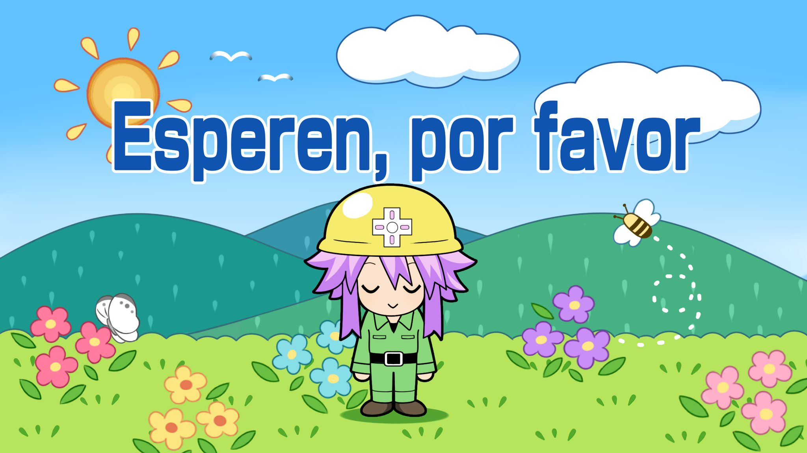

I thought at first that templates and Jekyll were limited, but that's not true! It can do a lot more, but rarely you get the chance to do more interesting things.

# Common Stuff

Basic commands.

# Cool Stuff

This is what the page was made for.

## Text Color

1. <span style="color:#ff6347">**Panel Macro**</span>
2. <span class="highlight">Panel Macro</span>

<style>
.highlight {
  color: #ff6347; /* Example color (Tomato) */
  font-weight: bold; /* Example style (bold text) */
}
</style>

<details>
  <summary>See Code</summary>

  ```html
  1. <span style="color:#ff6347">**Panel Macro**</span>
  2. <span class="highlight">Panel Macro</span>

      <style>
        .highlight {
          color: #ff6347; /* Example color (Tomato) */
          font-weight: bold; /* Example style (bold text) */
        }
      </style>
  ```
</details>


## Links

1. [Link to Another Markdown Section](#expandable-blocks)
2. <a href="https://youtu.be/dQw4w9WgXcQ?si=PhZ3KjgImSJVEXaL" target="_blank">Open a New Tab</a>

```
1. [Link to Another Markdown Section](#expandable-blocks)
2. <a href="https://youtu.be/dQw4w9WgXcQ?si=PhZ3KjgImSJVEXaL" target="_blank">Open a New Tab</a>
```

## Expandable Blocks

Markdown itself does not natively support expandable or collapsible sections. However, you can use HTML `<details>` and `<summary>` tags to create expandable sections in environments that support HTML within Markdown (e.g., GitHub, GitLab). Note that not all Markdown renderers support this.

- <details>
  <summary>Click to expand</summary>
  <p>This is the content that will be hidden until clicked.</p>
</details>


```markdown
<details>
  <summary>Click to expand</summary>
  <p>This is the content that will be hidden until clicked.</p>
</details>
```

## Import Images

### **Image Handling in Markdown**

- **No Format:**
  

- **With Format:**
  

- **Popup Image:**
  
  

<details>
  <summary>See Code</summary>

  ```
  # No Format:

  

  # With Format:

  <a href="page.html">
    
  </a>

  # Popup Image

  <!-- Trigger/Open The Modal -->
  

  <style>
  .modal {
    display: none;
    position: fixed;
    z-index: 1;
    left: 0;
    top: 0;
    width: 100%;
    height: 100%;
    overflow: auto;
    background-color: rgba(0,0,0,0.9);
    display: flex;
    justify-content: center;
    align-items: center;
  }

  .modal-content {
    margin: auto;
    display: block;
    max-width: 90%;
    max-height: 80vh;
    border-radius: 4px;
  }

  .close {
    position: absolute;
    top: 20px;
    right: 35px;
    color: #fff;
    font-size: 40px;
    font-weight: bold;
    transition: 0.3s;
  }

  .close:hover,
  .close:focus {
    color: #bbb;
    text-decoration: none;
    cursor: pointer;
  }
  </style>

  <!-- The Modal -->
  <div id="myModal" class="modal">
    <span class="close">&times;</span>
    
  </div>

  <script>
  // Get the modal
  var modal = document.getElementById("myModal");

  // Get the image and insert it inside the modal
  var img = document.getElementById("myImg");
  var modalImg = document.getElementById("img01");

  img.onclick = function(){
    modal.style.display = "flex";
    modalImg.src = this.src;
  }

  // Get the <span> element that closes the modal
  var span = document.getElementsByClassName("close")[0];

  span.onclick = function() { 
    modal.style.display = "none";
  }

  // Close the modal when pressing the "Esc" key
  document.onkeydown = function(event) {
    if (event.key === "Escape") {
      modal.style.display = "none";
    }
  }
  </script>

  # Copy to Clipboard

  <button onclick="copyToClipboard()">Copy Text</button>
  <input type="text" value="This is the text to be copied" id="myInput">

  <script>
  function copyToClipboard() {
    var copyText = document.getElementById("myInput");
    copyText.select();
    document.execCommand("copy");
    alert("Copied the text: " + copyText.value);
  }
  </script>
  ```
</details>

<style>
  .modal {
    display: none;
    position: fixed;
    z-index: 1;
    left: 0;
    top: 0;
    width: 100%;
    height: 100%;
    overflow: auto;
    background-color: rgba(0,0,0,0.9);
    display: flex;
    justify-content: center;
    align-items: center;
  }

  .modal-content {
    margin: auto;
    display: block;
    max-width: 90%;
    max-height: 80vh;
    border-radius: 4px;
  }

  .close {
    position: absolute;
    top: 20px;
    right: 35px;
    color: #fff;
    font-size: 40px;
    font-weight: bold;
    transition: 0.3s;
  }

  .close:hover,
  .close:focus {
    color: #bbb;
    text-decoration: none;
    cursor: pointer;
  }
  </style>

  <!-- Trigger/Open The Modal -->
  

  <!-- The Modal -->
  <div id="myModal" class="modal">
    <span class="close">&times;</span>
    
  </div>

  <script>
  // Get the modal
  var modal = document.getElementById("myModal");

  // Get the image and insert it inside the modal
  var img = document.getElementById("myImg");
  var modalImg = document.getElementById("img01");

  img.onclick = function(){
    modal.style.display = "flex";
    modalImg.src = this.src;
  }

  // Get the <span> element that closes the modal
  var span = document.getElementsByClassName("close")[0];

  span.onclick = function() { 
    modal.style.display = "none";
  }

  // Close the modal when pressing the "Esc" key
  document.onkeydown = function(event) {
    if (event.key === "Escape") {
      modal.style.display = "none";
    }
  }
  </script>

