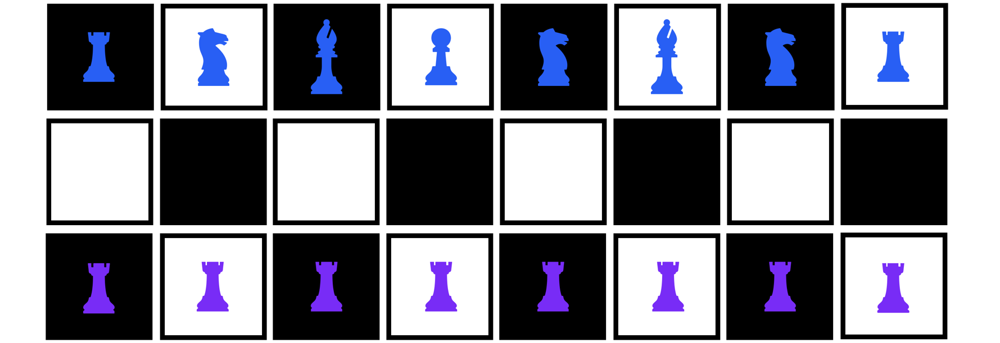

> "The mind is not a vessel to be filled, but a fire to be kindled." — Plutarch

---

# How This Mini-Book Can Help You

Nobody teaches you how to mentor. One day you are the person asking questions, and the next you are the person other people ask. The transition happens gradually and without ceremony. You do not get a manual. You figure it out by doing it — and by remembering what worked and what did not when you were on the other side.

This mini-book is an attempt to write that manual.

It covers mentoring in tech, but most of it applies beyond tech. The core challenge is the same everywhere: you know something, someone else needs to learn it, and the distance between those two states is not just knowledge. It is trust, timing, and knowing when to push and when to wait.

If you have ever been responsible for someone else's growth — whether formally or because they just started asking you things — this is for you.

 

# Chapters Overview

- [Chapter 1: What Mentoring Actually Is](/pages/mentoring-chapter-1): The difference between mentoring, managing, and teaching — and why it matters.
- [Chapter 2: Reading People](/pages/mentoring-chapter-2): Adjusting to different stages, experience levels, and personalities.
- [Chapter 3: The Hard Parts](/pages/mentoring-chapter-3): When mentoring fails, when to let go, and the leadership question.

 

---

  <a href="/pages/mentoring-chapter-1" class="custom-button left"><strong>Chapter 1</strong></a>

