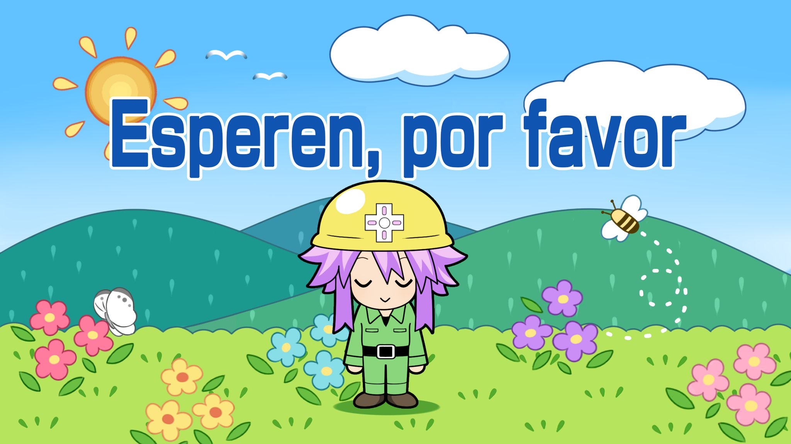

>"Somehow HTML has return"

---

I thought at first that templates and Jekyll were limited, but that's not true! It can do a lot more, but rarely you get the chance to do more interesting things.


# Repository

## Templates

## Structure

To use other layout or make changes to the existent one, make a copy from the original repository and do the proper changes.

Then place it under:

```bash
.
└── yoursite.github.io/
    ├── _layouts/
    │   ├── custom.html
    │   └── default.html
    ├── assets/
    │   └── css/
    │       └── style.scss
    ├── images/
    ├── pages/
    │   ├── a.md
    │   ├── b.md
    │   └── c.md
    ├── _config.yml
    ├── favicon.ico
    └── index.md
```

## Layout Overwrite

There are a lot of values that you can change directly in each page, this is how you do it:

```markdown

---
layout: custom
title: Markdown
description: 
---

```

There a lot of parameters that you can update, but that's for another time!


# Markdown and HTML

Basic commands.

## Favicon

Inside of the head of your layout you must include the following line `<link rel="icon" href="/favicon.ico" type="image/x-icon">`

I mention that because as I have multiple subpages handling that in everything would be complex.

You can either overwrite the default.html or create a new one an refer it.

## Layout

# Cool Stuff

This is what the page was made for.

## Color Reference

Here's a small square displaying the color `#ff6347` (Tomato):

1. <div class="color-square" style="background-color: #ff6347;" title="#ff6347 (Tomato)"></div>

<div class="color-square" style="background-color: #ff6347;" title="#ff6347 (Tomato)"></div>

<style>
.color-square {
    width: 20px;
    height: 20px;
    display: inline-block;
    border: 1px solid #000;
    cursor: pointer;
    transition: transform 0.3s ease;
}
.color-square:hover {
    transform: scale(1.2);
}
</style>

<details>
  <summary>> See Code</summary>

  ```html
  1. <div class="color-square" style="background-color: #ff6347;" title="#ff6347 (Tomato)"></div>
  2. <div class="color-square" style="background-color: #ff6347;"></div>


  <style>
  .color-square {
      width: 20px;
      height: 20px;
      display: inline-block;
      border: 1px solid #000;
      cursor: pointer;
      transition: transform 0.3s ease;
  }
  .color-square:hover {
      transform: scale(1.2);
  }
  </style>
  ```
</details> <br>

## Text Color

1. <span style="color:#ff6347">**Panel Macro**</span>
2. <span class="highlight">Panel Macro</span>

<style>
.highlight {
  color: #ff6347; /* Example color (Tomato) */
  font-weight: bold; /* Example style (bold text) */
}
</style>

<details>
  <summary>> See Code</summary>

  ```html
  1. <span style="color:#ff6347">**Panel Macro**</span>
  2. <span class="highlight">Panel Macro</span>

      <style>
        .highlight {
          color: #ff6347; /* Example color (Tomato) */
          font-weight: bold; /* Example style (bold text) */
        }
      </style>
  ```
</details> <br>


## Links

1. [Link to Another Markdown Section](#expandable-blocks)
2. <a href="https://youtu.be/dQw4w9WgXcQ?si=PhZ3KjgImSJVEXaL" target="_blank">Open a New Tab</a>

```
1. [Link to Another Markdown Section](#expandable-blocks)
2. <a href="https://youtu.be/dQw4w9WgXcQ?si=PhZ3KjgImSJVEXaL" target="_blank">Open a New Tab</a>
```

## Expandable Blocks

Markdown itself does not natively support expandable or collapsible sections. However, you can use HTML `<details>` and `<summary>` tags to create expandable sections in environments that support HTML within Markdown (e.g., GitHub, GitLab). Note that not all Markdown renderers support this.

1.  <details>
    <summary>Click to expand</summary>
    <p>This is the content that will be hidden until clicked.</p>
  </details>


<details>
  <summary>> See Code</summary>

  ```html
  1.  <details>
    <summary>Click to expand</summary>
      <p>This is the content that will be hidden until clicked.</p>
    </details>
  ```
</details> <br>

## Import Images

### **Image Handling in Markdown**

- **No Format:**
  

- **With Format:**
  

- **Popup Image:**
  
  
<details>
<summary>> See Code</summary>
<pre>
# No Format:


# With Format:
&lt;a href="page.html"&gt;
  &lt;img src="../images/neptunia-please-wait.png" alt="Example Image" style="border: 2px solid #000; border-radius: 4px; padding: 5px;" /&gt;
&lt;/a&gt;

# Popup Image
&lt;img id="myImg" src="../images/neptunia-please-wait.png" alt="Example Image" style="border: 2px solid #000; border-radius: 4px; padding: 5px; max-width: 200px; cursor: pointer;"&gt;

&lt;style&gt;
.modal {
  display: none;
  position: fixed;
  z-index: 1;
  left: 0;
  top: 0;
  width: 100%;
  height: 100%;
  overflow: auto;
  background-color: rgba(0,0,0,0.9);
  display: flex;
  justify-content: center;
  align-items: center;
}

.modal-content {
  margin: auto;
  display: block;
  max-width: 90%;
  max-height: 80vh;
  border-radius: 4px;
}

.close {
  position: absolute;
  top: 20px;
  right: 35px;
  color: #fff;
  font-size: 40px;
  font-weight: bold;
  transition: 0.3s;
}

.close:hover,
.close:focus {
  color: #bbb;
  text-decoration: none;
  cursor: pointer;
}
&lt;/style&gt;

&lt;!-- The Modal --&gt;
&lt;div id="myModal" class="modal"&gt;
  &lt;span class="close"&gt;&times;&lt;/span&gt;
  &lt;img class="modal-content" id="img01"&gt;
&lt;/div&gt;

&lt;script&gt;
// Get the modal
var modal = document.getElementById("myModal");

// Get the image and insert it inside the modal
var img = document.getElementById("myImg");
var modalImg = document.getElementById("img01");

img.onclick = function(){
  modal.style.display = "flex";
  modalImg.src = this.src;
}

// Get the &lt;span&gt; element that closes the modal
var span = document.getElementsByClassName("close")[0];

span.onclick = function() { 
  modal.style.display = "none";
}

// Close the modal when pressing the "Esc" key
document.onkeydown = function(event) {
  if (event.key === "Escape") {
    modal.style.display = "none";
  }
}
&lt;/script&gt;

# Copy to Clipboard

&lt;button onclick="copyToClipboard()"&gt;Copy Text&lt;/button&gt;
&lt;input type="text" value="This is the text to be copied" id="myInput"&gt;

&lt;script&gt;
function copyToClipboard() {
  var copyText = document.getElementById("myInput");
  copyText.select();
  document.execCommand("copy");
  alert("Copied the text: " + copyText.value);
}
&lt;/script&gt;
</pre>
</details>

<br>


## Content Tips

