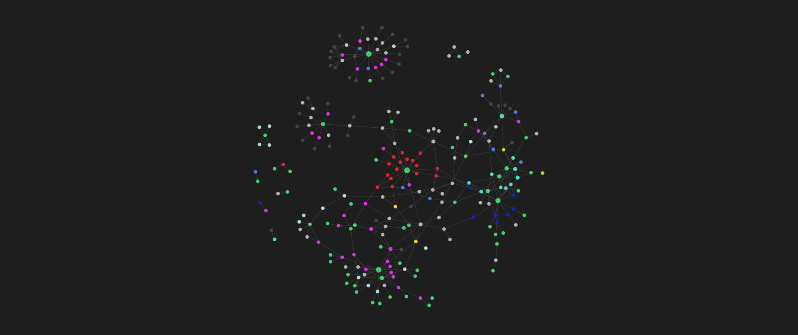

Taking notes always has been a problem to solve for me, until I stumble thanks to the Algorythm with Obsidian, and the neuron-like format to display links between "ideas".

It really takes a weight from my shoulders, a lot of information, a lot of plans, and even if you think you don't have, you may, just that you are not aware.
