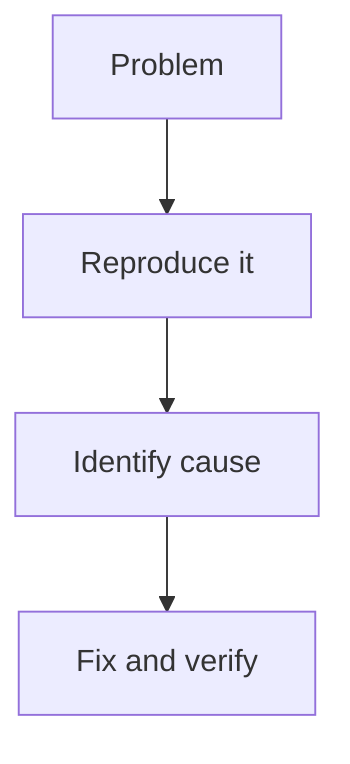

---

Taking notes has always been a problem to solve for me, until the algorithm surfaced Obsidian and its graph-based view of connected ideas.

The neuron-like display of links between notes does something different from a regular folder structure. It shows you what connects to what, which means you start to see patterns in your thinking that you would not notice in a list. A lot of people find they have more information and more half-formed plans than they realized. They were just scattered across different places with no way to see the relationships.

That is the thing Obsidian fixes.

---

# Plugins

## Start with the core ones

Obsidian ships with built-in plugins that are off by default. Go to **Settings → Core plugins** and enable:

- **Graph view**: the node-link display that shows how your notes connect. More on this below.
- **Templates**: lets you define reusable note structures. Useful for meeting notes, project pages, or daily logs.
- **Daily notes**: creates a new note for each day with a single command. Good for capture and journaling.
- **Backlinks**: shows every note that links to the one you are currently reading. Helps you discover connections you forgot you made.
- **Outgoing links**: the reverse, shows what the current note points to. Useful when reviewing old notes.
- **Tags**: adds a tag pane to the sidebar for browsing notes by tag.

## Community plugins worth adding

Go to **Settings → Community plugins → Browse**. A few that genuinely change how the tool works:

- **Dataview**: query your notes like a database. You can ask things like "show me all notes tagged `#project` created this week" and get a live table. Steep learning curve, high ceiling.
- **Templater**: more powerful version of the core Templates plugin. Supports dynamic values like current date, prompts, and JavaScript snippets.
- **Calendar**: adds a small calendar to the sidebar. Each day links to that day's daily note. Simple and very useful.
- **Obsidian Git**: automatically commits and pushes your vault to a GitHub repository. Free backup with version history and no subscription required.
- **QuickAdd**: fast capture. One hotkey to create a note from a template or append a line to an existing note without leaving what you are doing.
- **Tasks**: adds task management across notes. You can query all open tasks across the entire vault regardless of which note they live in.

---

# Organizing your vault

There are two main philosophies and both work. The trap is trying to find the "right" one before you have any notes.

**Folder-based**: organize by topic, project, or status. The PARA method (Projects, Areas, Resources, Archives) by Tiago Forte maps well here. Easy to understand, familiar from any file system.

**Link-based**: use a mostly flat structure and rely on links between notes to create organization. This is the Zettelkasten approach. Notes end up organized by relationship rather than by location.

Most people land on a hybrid. A few top-level folders for broad categories, and within them, notes connected to each other rather than sorted into subfolders.

One pattern worth trying is the **Map of Content (MOC)**: a note that serves as an index for a topic. Instead of a folder called `Work`, you have a note called `Work` that links to every work-related note. You can still have the folder, but the MOC is the real entry point. It is easier to maintain and it shows relationships that a folder cannot.

The main point: folders are for comfort, links are for navigation. Do not over-engineer the folder structure early. Obsidian's search and graph make notes findable even when the filing is messy.

---

# Tags and links

## Internal links

```
[[Note name]]               link to a note
[[Note name|Display text]]  link with a custom label
[[Note name#Heading]]       link to a specific heading
![[Note name]]              embed the full note inline
![[image.png]]              embed an image
```

Type `[[` anywhere in a note to trigger autocomplete. Obsidian searches your vault as you type.

## Tags

Add tags anywhere in the note body with `#tagname`. You can also declare them in the frontmatter:

```yaml
---
tags: [work, project, q1]
---
```

Nested tags work with a slash: `#work/project` or `#area/health`. This lets you browse by parent category in the tag pane without creating a long flat list.

A few conventions that help:

- Use tags for type or status: `#draft`, `#reference`, `#person`, `#project`
- Use links for relationships: link to a note about a project rather than tagging everything with the project name
- Tags are for filtering. Links are for navigating.

## Aliases

If you want to link to a note by a different name, add aliases in the frontmatter:

```yaml
---
aliases: [Q1 planning, planning doc]
---
```

Typing `[[Q1 planning]]` will resolve to the note even if the actual filename is something else. Useful when a concept has multiple common names.

---

# The graph view

Open it with **Cmd+G** on Mac or **Ctrl+G** on Windows, or click the graph icon in the left sidebar.

Every note is a dot. Every link is a line. Notes with more connections appear larger. Notes with no links sit alone at the edges, which is how you notice the orphans.

**Local graph**: while inside a note, right-click the graph icon and choose "Open local graph." This shows only the current note and its immediate connections. More useful day-to-day than staring at the full vault.

**Filtering**: in the graph controls panel (top-right corner of the graph view) you can filter by tag, folder, or file path. Useful for focusing on one project without the rest of the vault cluttering the view.

**Groups**: color-code nodes by tag or folder. Open graph controls and add a group with a query like `tag:#project`. Each group gets its own color. This makes the graph readable instead of just decorative.

A realistic expectation: the graph is most useful for discovering unexpected connections and spotting orphaned notes. It is also genuinely satisfying to watch it grow over months. Neither of those is a small thing.

---

# Other things worth using

**Canvas**: built into Obsidian since version 1.1, no plugin required. A free-form board where you can place notes, images, cards, and web pages, then draw connections between them. Good for planning and brainstorming, and for visualizing relationships that do not fit into linear notes.

**Callouts**: native syntax for highlighted blocks, no plugin needed:

```markdown
> [!note]
> A standard note callout.

> [!warning]
> Something to be careful about.

> [!tip]
> Other types: info, success, question, danger, example, quote.
```

**Quick switcher**: **Cmd+O** on Mac or **Ctrl+O** on Windows. Fuzzy search across all note titles. Faster than the file explorer once you have more than a handful of notes.

**Mermaid diagrams**: Obsidian renders Mermaid natively inside fenced code blocks:

````markdown

````

**Themes**: **Settings → Appearance → Themes**. The default is clean. Minimal and Things are popular community themes if you want something different. Themes only affect appearance, nothing functional changes.

**Sync options**: Obsidian Sync is the official paid option and the most seamless. Free alternatives: iCloud works well on Apple devices, and Obsidian Git works on any platform with a GitHub account. The vault is just a folder of plain text files, so any cloud sync service works at the most basic level.
