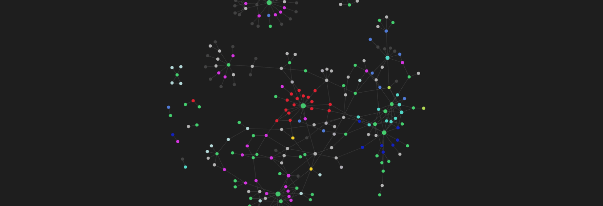

Taking notes has always been a problem to solve for me, until the algorithm surfaced Obsidian and its graph-based view of connected ideas.

The neuron-like display of links between notes does something different from a regular folder structure. It shows you what connects to what, which means you start to see patterns in your thinking that you would not notice in a list. A lot of people find they have more information and more half-formed plans than they realized. They were just scattered across different places with no way to see the relationships.

That is the thing Obsidian fixes.
