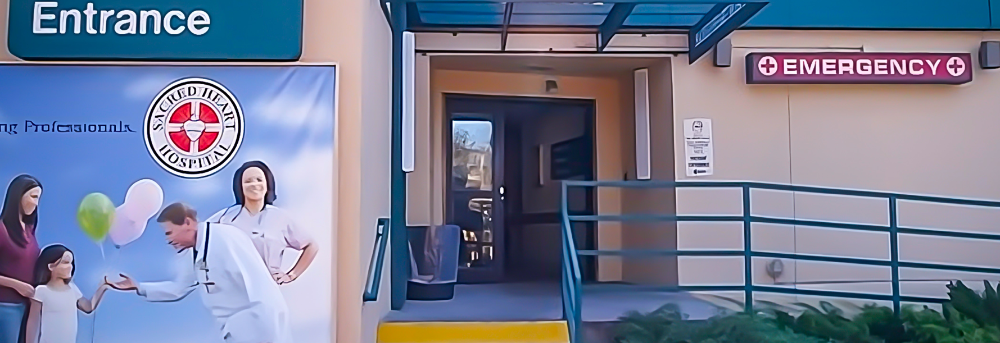

---

# Intro

Earlier this year, I faced a family emergency that required me to spend significant time in a hospital. Witnessing doctors in action as they handled critical, near-death cases left a lasting impression on me.

What struck me, besides the emotional weight of the situation, was how coordinated and rapid their response was. Despite the intensity, every team member knew their role, communicated clearly, and worked with precision—much like a machine.

In contrast, when I look at how we work in tech, especially under pressure, it can feel more like a choreographed dance with unexpected stumbles. Missteps and communication breakdowns are common. We often end up reacting rather than acting with purpose. It got me thinking: What if we took a page from the emergency room playbook?

In tech, we tend to operate more like general practitioners, treating stable, routine issues. But when things go south—when the system is on the verge of collapse or a high-severity incident occurs—those generalist skills may no longer be enough. Like in medicine, we call in specialists. However, what if we trained our teams to handle those situations with the same kind of precision as an emergency medical team? We wouldn't need more specialists; we could empower our existing teams with the skills, processes, and mindset to operate effectively in high-pressure scenarios.

This concept may take time to fully develop, but I believe it has the potential to revolutionize the way we work or at least a second best option, make my work more simple.

# Intake Process

## Initial Assessment

The triage nurse's role is to determine the urgency of the patient's condition and decide how quickly they need to see a doctor.

## Categorization into Priority Levels

Patients are then classified into different levels of priority, depending on their condition’s severity. The exact names of these levels may vary depending on the hospital or country, but the system is generally divided into 3 to 5 levels, such as:

- Level 1 (Immediate/Emergent): Life-threatening conditions that require immediate medical intervention. Examples include heart attacks, severe trauma, or respiratory failure.
- Level 2 (Urgent): Serious conditions that are not immediately life-threatening but could become critical if not treated quickly. Examples include severe pain, difficulty breathing, or large wounds.
- Level 3 (Less Urgent): Conditions that are concerning but stable. These patients may wait longer to be seen. Examples include mild asthma attacks, broken bones without complications, or infections.
- Level 4 (Non-Urgent): Stable conditions that require medical care but do not pose an immediate risk to the patient’s health. These patients can often wait for a more extended period before treatment. Examples include minor cuts, sprains, or mild fevers.
- Level 5 (Routine): Minor ailments or injuries that do not require immediate attention and are unlikely to deteriorate quickly. Examples include colds, minor rashes, or routine check-ups.

## Treatment Based on Priority
After categorization, patients are treated based on their priority level rather than the order of their arrival. This means that a person with a life-threatening condition (Level 1) will be seen right away, while someone with a less urgent problem (Level 4 or 5) may have to wait.

In Level 1 and Level 2 situations, immediate medical attention is provided, often involving the coordination of multiple medical professionals.
For Level 3, 4, or 5, patients may be directed to other areas of the hospital, or they might wait in a designated area until a doctor or nurse is available.

## Continuous Reassessment
Triage is not a one-time process. Patients in the waiting area are continuously reassessed to ensure that their condition is not worsening. If a patient's condition deteriorates, they may be moved to a higher priority level and treated sooner.

Key Principles of Triage:
Urgency over arrival time: The most critical patients are treated first, regardless of when they arrived.
Resource allocation: The hospital allocates resources (doctors, nurses, equipment) to the patients who need them most urgently.
Efficient workflow: Triage ensures that the emergency department operates efficiently and that care is provided in an organized manner, even when the hospital is busy or overwhelmed.
Example of Triage in Practice:
Imagine an ER where three patients arrive at the same time:

Patient A: A person having a heart attack (Level 1 – Immediate).
Patient B: A person with a broken leg (Level 3 – Less Urgent).
Patient C: A person with a mild cold (Level 5 – Routine).
In this case, the triage nurse will ensure that Patient A is treated immediately, while Patient B will be seen when resources become available. Patient C may wait the longest, as their condition does not pose an immediate threat.

## Tech Translation

In tech, you could adopt a similar approach to classify incidents or system issues. For example:

- Level 1 (Immediate): Critical outages, security breaches, or data corruption requiring immediate action.
- Level 2 (Urgent): Performance degradation or partial outages that could escalate.
- Level 3 (Less Urgent): Issues like slow response times that impact some users but are not system-wide.
- Level 4 (Non-Urgent): Minor bugs that don’t affect core functionalities.
- Level 5 (Routine): Cosmetic issues or low-impact bugs that can be fixed when time allows.

By applying triage in tech, you can ensure that critical problems are resolved first while lower-priority issues are handled in due course, much like in a hospital emergency room.

# Team Roles and Specialization

To define roles for your "tech doctors" (engineers) within the context of your emergency room analogy, it’s important to focus on their responsibilities during high-pressure incidents and structure teams based on specialized expertise and cross-functional capabilities. Here’s a breakdown of potential roles, inspired by hospital roles, that can help structure an engineering team to work efficiently during incidents:

## Incident Commander (Lead Doctor / Emergency Room Attending)

- Role: This person is the overall leader during an incident, overseeing the entire operation. They make the final decisions and coordinate efforts across the team. They have the broadest view of the situation and ensure that resources are used effectively.
- Responsibilities:
  - Directing the response to major incidents.
  - Making decisions on priorities and allocating resources (like which team works on what issue).
  - Communicating with stakeholders, such as management, customers, or other departments.
  - Ensuring that the team is focused on resolving the most critical issues first.

Example in Tech: The Incident Commander would be the "lead engineer" or tech lead during a system outage, coordinating the efforts of different teams.

## Subject Matter Experts (Specialist Doctors)

- Role: These are the engineers who are deeply specialized in specific areas, like database management, network infrastructure, or security. When an incident falls within their area of expertise, they take charge of diagnosing and resolving that specific issue.
- Responsibilities:
  - Providing expertise in their specific domain to resolve the issue at hand.
  - Diagnosing the root cause of the incident within their area.
  - Implementing fixes or guiding generalists in applying solutions.

Example in Tech: During a database failure, the Database SME would take the lead in restoring the database while working alongside others to ensure system-wide recovery.

## Generalist Engineers (Emergency Room Nurses)

- Role: Like nurses who can handle a range of tasks in the ER, generalist engineers are skilled in multiple areas but don’t specialize deeply in one. They assist the specialists in fixing the immediate issue and ensure smooth operations in non-critical areas.
- Responsibilities:
  - Supporting the specialists by handling secondary tasks.
  - Applying fixes that don’t require deep expertise but are necessary to keep the system functioning.
  - Providing backup support in areas where they have some knowledge, especially during large-scale incidents.

Example in Tech: A generalist might be able to handle simple database maintenance, network reconfiguration, or server resets to relieve the specialist for more complex tasks.

## Triage Engineer (Triage Nurse / Dispatcher)

- Role: This engineer assesses the incoming issues, classifies them based on severity, and ensures that the right people are working on the most critical problems. They are often the first to interact with the incident report and determine the level of urgency.
- Responsibilities:
  - Classifying incidents based on priority (critical, high, medium, low).
  - Assigning incidents to the appropriate team members or specialists.
  - Monitoring the overall system to spot issues early and escalate as needed.
  - Continuously reassessing issues if new information arises, or if a situation deteriorates.

Example in Tech: A Triage Engineer could be the first responder to monitor system alerts or support tickets, making sure they’re appropriately routed to the team that can solve the problem fastest.

## Communications Officer (ER Coordinator / Patient Liaison)

- Role: Much like a hospital ER coordinator, this person is responsible for maintaining clear communication with external teams, departments, or stakeholders during the incident. They ensure that critical information is communicated effectively and that non-technical teams understand the situation.
- Responsibilities:
  - Keeping management, customers, and other stakeholders informed of the incident's status.
  - Relaying key information between the tech team and external teams (e.g., business, product, or customer success).
  - Ensuring that the Incident Commander and the rest of the team aren’t overwhelmed by communication tasks.

Example in Tech: A Communications Officer could update a status page, inform leadership, and handle any customer-facing messaging during a major system outage, letting the engineers focus on resolving the problem.

## Support Engineer (Resident Doctor / Intern)

- Role: Support engineers are less experienced but can still handle important tasks under supervision. Like residents in a hospital, they assist with simpler tasks, learn from the specialists, and develop their skills in a high-pressure environment.
- Responsibilities:
  - Handling smaller, non-critical tasks that free up senior engineers to focus on the main incident.
  - Assisting senior engineers by gathering data or running diagnostics.
  - Learning on the job by working closely with more experienced engineers.

Example in Tech: A junior support engineer might handle lower-priority tasks like checking logs, restarting services, or monitoring system health during an incident.

## Post-Incident Analyst (Post-Op Team)

- Role: After the incident is resolved, this role focuses on analyzing what happened, what went right, and what went wrong. Their job is to ensure that lessons are learned and applied to improve the response for future incidents.
- Responsibilities:
  - Conducting a detailed post-incident review.
  - Identifying the root cause of the incident and how it could have been prevented.
  - Proposing changes to processes, tools, or training based on the findings.
  - Organizing a debrief session with the entire team to gather feedback.

Example in Tech: A Post-Incident Analyst might lead a blameless postmortem meeting after an outage, focusing on system improvements and process refinements.

# Cross-Training and Simulation Drill

# Clear Protocols and Communication Channels

# Mindset and Emotional Readiness

# Debrief and Continuous Improvement

# Pandemic Lessons