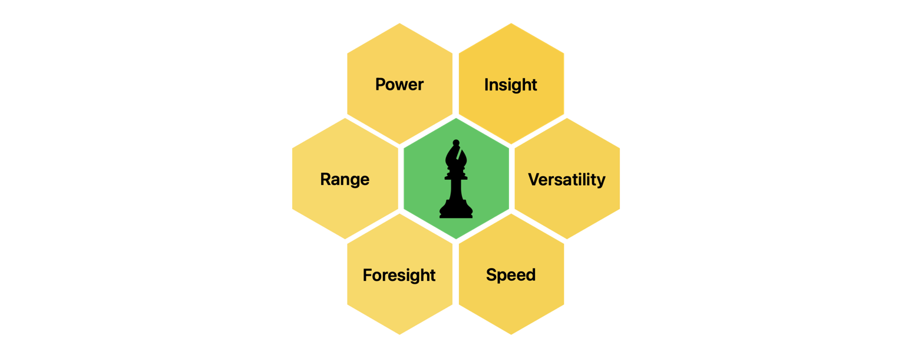
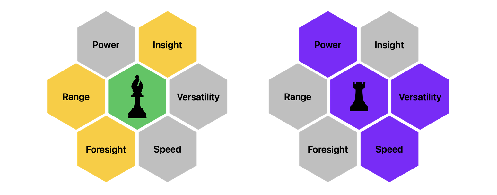

  <a href="/pages/thesis-the-core-five-1" class="custom-button right"><strong>Chapter 1</strong></a>
  <a href="/pages/thesis-the-core-five-2" class="custom-button left"><strong>Chapter 2</strong></a>

---

---

I've had my fair share of onboardings and interviews, one thing that always sticks is that sometimes the aim is a little of.

It reminds me of that blog that I read a while ago sometime, the title summarizes everything "Companies don't need geniuses" which apply very well when discussing about the expectations of a position.

If you need to hire a genius to work with you, you either are pushing the boundaries of innovation or just searching for unicorns.

Delivery Pieces

# The Core Five

- **Power**: Expertise in one or multiple fields, Time available to improve, Focus.
- **Range**: Scope of solutions Reusability, Efficacy.
- **Foresight**: Anticipation, Planification, Risk Management.
- **Insight**: Context, Company and Standard knowledge.
- **Versatility**: Readapt, reuse to multiple scenarios.
- **Speed**: Delivery Time,  Engagement.

It's not about the thing that you are an expert with, it's about the qualities that you have.

## The Speaker

In my personal opinion I'm well balanced, at the point that some things are no longer fun. 

Even with multiple advantages, and the combination of skills, the real magic comes from the elements added by people. These can range from ideas, actitudes or even memes.

I've leverage my speed a lot to get the advantage and overcome challenges in the past, that's why I have the notion that it's not just raw "power" what can get you results. So it's sad to think of people that can't make it because they don't fall under the common categories.

## Combinations

Compensating it's not that bad as it seems.

- Versatility + Speed: can compensate Power.
- Power + Speed: can compensate Versatility.
- Power + Versatility: can compensate Speed.
- Range requires more, but it is possible.

# Potentiation

Enforcing to reach the level of shared skills will only lead to waste, on contrary, working on the gaps can potentiate and lead to better results. This doesn't mean that studying isn't important.

Some expected skills are usually missing like the insight of the project, reducing the time to pass from it and get down to business should be a priority to "automate".

## Automation Opportunities

# Dangers of My Heart

