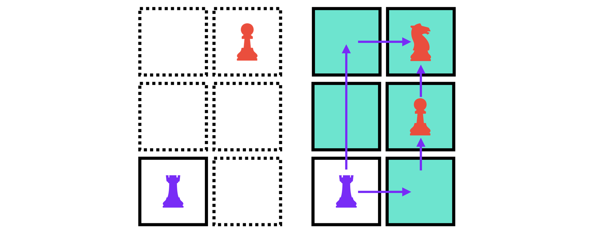

<!--- https://darksouls.wiki.fextralife.com/Character+Information --->

  <a href="/pages/thesis-the-core-five" class="custom-button right"><strong>Go Back to Home</strong></a>
  <a href="/pages/thesis-the-core-five-2" class="custom-button left"><strong>Chapter 2</strong></a>

---

---

# The Core Five

Dividing skills into just "soft" and "technical" feels like an oversimplification, especially in the tech world. These labels don’t capture the full complexity of what it takes to thrive in modern roles, where the lines between expertise, collaboration, and creativity are increasingly blurred.

Based on my experience working with teams in big companies I had divided the categories into six dimensions:

- **Power**: Expertise in one or multiple fields, Time available to improve, Focus.
- **Range**: Scope of solutions Reusability, Efficacy.
- **Foresight**: Anticipation, Planification, Risk Management.
- **Insight**: Context, Company and Standard knowledge.
- **Versatility**: Readapt, reuse to multiple scenarios.
- **Speed**: Delivery Time,  Engagement.

These dimensions provide a more complete view of the abilities required for tech jobs, where success often comes from the interplay of strengths rather than isolated skills. By focusing on these, we can better evaluate, develop, and celebrate the unique contributions that every individual brings.

## About The Speaker

In my personal view, I’ve reached a level of balance where some things no longer feel as exciting. It’s an interesting paradox: achieving proficiency can sometimes take away the thrill of the journey.

Despite having multiple advantages and a blend of skills, I’ve come to realize that the true magic comes from the unique elements that people bring to the table. These contributions—whether they are fresh ideas, attitudes, or even lighthearted memes—are what make collaboration dynamic and impactful.

Personally, I’ve leaned heavily on speed to gain an edge and tackle challenges in the past. This experience has taught me that success isn’t just about raw “power” or expertise—it’s about leveraging all dimensions of ability. It’s disheartening to think of talented individuals being overlooked simply because they don’t fit into traditional molds or categories.

# Potentiation

Focusing solely on enforcing shared skills across the board often leads to inefficiencies and wasted effort. Instead, addressing and bridging gaps can unlock potential and drive better outcomes.

This doesn’t mean that studying and improving foundational skills aren’t important—quite the opposite. The key lies in balancing individual strengths while strategically filling in areas of weakness. When gaps are acknowledged and worked on, the result is a more cohesive and high-performing team or individual.

## Starting Point

Ideally, your company or direct lead should provide a clear roadmap for improving technical skills. In the worst-case scenario, there should at least be some guidance on the expected outcomes for the role and areas requiring improvement, assuming that feedback is part of the equation.

Now, let’s imagine you do have a roadmap. It’s well-designed, supplemented by structured training programs, and supported by a mentorship system to track the technical progress. Even then, it’s not enough.

If it were that simple, providing a few licenses for curated programs or courses should suffice to elevate skills and ensure people perform at the expected level for their roles. While access to these resources is valuable, true growth requires more than just tools. It demands consistent guidance, actionable feedback, and opportunities to apply learning in meaningful and challenging contexts.

If you don’t have a plan, make one. It’s always better to have something to guide you than nothing at all.

## The Ego

A solid base of knowledge is just facts—it’s not the same as real, hands-on experience. The difference between someone who spends 10 hours sitting through a course and someone who spends 5 hours banging their head against a wall under pressure, plus 2 hours facing clients, is staggering. The latter gains resilience, adaptability, and practical insights that no course can replicate.

But not everyone has the temperament or willingness to endure those challenges. Outside factors, such as personal life, can interfere and disrupt progress. So, what happens then?

It doesn't have to be always like that!

For my own sadness, most situations don’t need to escalate into a technical “fight”. Sometimes, the solution is as simple as listening and understanding. Yet, in a culture that often prioritizes proving one’s “power” and “speed” skills, other critical skills are overlooked. This imbalance frequently creates larger problems, which we’ll explore in Chapter Two, where we’ll discuss the dangers of scaling your “fight response” to match perceived challenges. Spoiler, it only leads to waste.

## Chain of Command

# Combinations

Compensating isn’t as limiting as it might seem—in fact, it’s where creativity and adaptability shine. Different combinations of skills can fill gaps and create balance in surprising ways:

- Versatility + Speed: A powerful duo that can compensate for a lack of raw Power.
- Power + Speed: Together, they can make up for limited Versatility.
- Power + Versatility: A strong pairing that can offset slower execution.
- Range: This one is more demanding to compensate for, but with the right mix of skills, it’s still achievable.

By understanding and leveraging these combinations, individuals and teams can turn perceived weaknesses into strengths and achieve remarkable results.

Some expected skills are usually missing like the insight of the project, reducing the time to pass from it and get down to business should be a priority to "automate".

# Automation Opportunities

Documentation in a way is the "automation"  to reduce the friction when joining a new project and increase the time for Leads/Managers to help out members on other critical areas/skills. In short, less telling of the good old histories and more focusing on the present.

All skills can be improved with "good" working experience, but the degree of improvement will variate... a lot.

Versatility, Insight, and Foresight can only get an real improved by understanding the decisions and learning.

Reading and Writing can allow people to artificially receive part of the experience.

## Chest Board

Not knowing the paths will make everything take longer, as the discovery phase will solely depend on the piece.

Knowing the available paths and possible challenges can lead to take better decisions 

Having documentation can make the difference for pieces to take challenges greater than their current level.

Reality checks are often needed to remind the piece that is only possible because is standing in shoulders of giants.