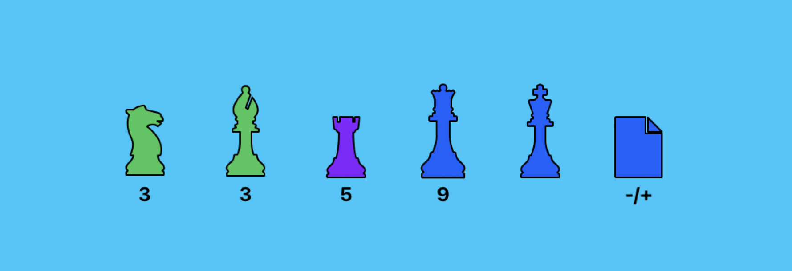



---

---

# The Probability Matrix

Chapter 2 covers matching and placement. This chapter maps those ideas to actual chess pieces based on their dimension profiles. The question is not how expert someone is in a specific technology. It is what qualities are we looking for.

Excluding the King (the business, the project, the thing everyone is protecting), each remaining piece type maps to a combination of the Core Five that shows up over and over in real teams.

| Piece | Power | Range | Foresight | Insight | Versatility | Speed |
|-------|-------|-------|-----------|---------|-------------|-------|
| Queen | High | High | High | High | High | High |
| Rook | High | Low | Low | Medium | Low | High |
| Bishop | Low | Medium | High | High | Medium | Low |
| Knight | Medium | High | Medium | Medium | High | Medium |
| Pawn | Low | Low | Low | Low | Low | Low |

This is not a ranking. A knight is not better or worse than a rook. They solve different problems and fail in different conditions. The matrix shows what each piece is most likely to bring to the board, and by extension, what it probably will not.

 

---

# The Pieces

## Queen

The manager, the lead, the person who can move in any direction at any distance. Queens speed things up because they have enough of every dimension to unblock situations without waiting for the right specialist.

The role of a queen on the board:

- Potentiate and arrange people rather than play every square
- Provide direction and clarity of the whole picture
- Handle the deadlines and the high-level conversations with the client
- Give insight about the movement of the pieces to whoever needs it

The risk is dependency. A team that routes every hard decision through one person has a single point of failure wearing a crown. When the queen is busy, or unavailable, or burns out, nothing moves.

Nothing personal, but heroes can become twisted. Same goes for geniuses. A hero will only create victims to be rescued. And whenever the hero is busy or not around, the people are helpless. That is not leadership. That is a bottleneck with a title.

 

## Rook

High Power, high Speed. The straight-line specialist. Rooks are reliable, fast, and strong within their lanes. Point them at a well-defined problem and they will solve it faster than anyone else on the board.

Power and Speed to get things done in their scope, and a safe bet to avoid having to do mental gymnastics.

The limitation is direction. A rook moves in straight lines. It cannot navigate diagonally. It cannot jump. When the problem requires cross-cutting solutions or lateral thinking, the rook will force a straight-line answer. Sometimes that works. Often it creates debt that someone else has to untangle later.

Power and Speed will struggle to deal with conditions that require versatility, leading to delays or missing the point entirely.

It is easier to play a game with only rooks, but not sustainable in time. A team of rooks delivers fast, handles crises well, and slowly accumulates a kind of rigidity that makes change progressively harder. This is also why engineers with tunnel vision cannot see priorities that seem obvious from above. Their dimension profile was not built for that angle.

 

## Bishop

High Foresight, high Insight. The diagonal thinker. Bishops see patterns, anticipate risks, and understand context. They flag a dependency issue three sprints before it becomes a blocker. They understand why the last three attempts at this problem failed.

The limitation is color. In chess, a bishop is locked to one color for the entire game. The technical equivalent is someone whose insight and foresight apply deeply within one domain but struggle to transfer to another. A bishop who understands infrastructure deeply may have blind spots in product decisions. Not from lack of intelligence, from lack of exposure.

Bishops are easy to undervalue because their output is invisible. They prevent problems rather than solve them loudly. In a culture that rewards firefighting, the bishop is the person who removed the lighter fluid that nobody noticed.

 

## Knight

High Versatility, high Range. The unconventional mover. Knights approach problems sideways, jump over blockers that stop everyone else, and produce solutions that work across multiple contexts.

Knights are harder to predict and harder to manage. Their strength is precisely their inability to move in straight lines. What looks like an unconventional approach from the outside is just how they see the board.

The value of a knight increases in complex positions. When there are many pieces, many constraints, many competing priorities, the knight's ability to navigate around obstacles makes them disproportionately useful. On a clean board with a simple objective, a rook will outperform them every time.

The delta of ideas and creativity from these engineers, rather than just squeezing their soul for output, is what they bring. But you have to let them move the way they move.

 

## Pawn

Low across all dimensions, currently. The pawn is potential. Junior engineers, new hires in unfamiliar contexts, people who have not yet had the opportunity to develop their profile.

The pawn's unique property is promotion. Given the right conditions (time, investment, a senior piece covering for them), a pawn can develop into any other piece type. The path they take depends on what dimensions the project and the mentorship actually develop.

A pawn on a Reactive project develops Power and Speed. That pawn becomes a rook. A pawn paired with a strong bishop, working on a Sustaining project with deep context needs, develops Foresight and Insight. That pawn becomes a bishop. A pawn exposed to diverse problems across teams, with a lead who encourages lateral thinking, develops Versatility and Range. That pawn becomes a knight.

The project type determines the piece type. That is why placement matters from day one, and why "just give them more work" as a development strategy only produces rooks.

 

---

# Compensation Patterns

Not every position requires every dimension. What matters is whether the dimensions present can cover for the ones that are absent.

| Combination | Compensates for | How it works |
|-------------|-----------------|--------------|
| Power + Speed | Versatility | Brute-force through what cannot be navigated around. Works short-term. |
| Versatility + Speed | Power | Adapt and iterate faster than the problem requires raw strength. |
| Power + Versatility | Speed | Depth plus breadth absorb the cost of taking longer. |
| Range | Hard to compensate | Scope of solutions cannot be faked by combining other dimensions. |

But certain skills require more than just good intentions and trying harder.

Range is the hardest to compensate because it requires exposure that no combination of other dimensions can substitute. You either have seen enough contexts to produce solutions that scale, or you have not. This is why people with high Range are disproportionately valuable and disproportionately expensive to lose.

 

## What It Looks Like on the Board

A rook (Power + Speed) can temporarily fill a role that needs a knight (Versatility + Range), but the solutions will be narrower. It works for now. It accumulates mismatch.

A knight can temporarily fill a role that needs a rook, but the delivery will be slower and less predictable. The solution will be better designed but arrive later.

A pair of rooks cannot do what one bishop does. No amount of execution speed replaces the ability to see the problem coming. But a rook paired with a bishop, where the bishop provides direction and the rook provides execution, produces more than either could alone.

Power and Speed with good support can allow pieces to position themselves correctly while they learn patterns to improve their movements. Other priorities can be kept in check with the help of a lead. But the idea is to allow the piece to handle it, not to handle it for them.

Because they need to be well placed and have other pieces to be accompanied by. That is what the board is for.

 

---

# Hidden Variables

The matrix assumes each piece is playing at its actual level. In practice, engineers often underperform their profile, and the reasons have nothing to do with the Core Five.

Why good engineers are not acting as they usually do against problems:

- **Perception**: how the person reads the situation. Two people seeing the same codebase will identify different problems based on what they have been trained to notice.
- **Character**: temperament under pressure. Some people shut down, some fight, some freeze. This is not a skill gap. It is a pattern that either fits the situation or does not.
- **Skills**: the gap between knowing and executing. Having Foresight does not mean the person has the specific technical skill to implement the solution they can see.
- **Empathy**: the ability to account for other people's constraints. Engineers who build solutions without considering the team that will maintain them are exhibiting a Versatility gap disguised as a technical one.
- **Politics**: the unwritten rules. Who approves what, which battles are worth fighting, whose opinion actually matters regardless of the org chart. Engineers who ignore politics do not avoid it. They get surprised by it.

These five variables modulate the Core Five. A knight with bad political awareness will propose excellent solutions that never get approved. A rook with low empathy will deliver fast but leave a trail of frustrated colleagues. The dimensions tell you what someone can do. The hidden variables determine whether they actually will.

The knowledge in one area does not necessarily transpose into other skills. This is why the engineer you hired at a certain level can still struggle with a problem that looks small from the outside. The problem is not in their level. It is in which dimensions the problem actually requires, and which hidden variables are interfering.

 

---

# Development Difficulty

Not all dimensions improve at the same rate or in the same way.

| Dimension | Improves through | Difficulty |
|-----------|-----------------|------------|
| Power | Practice, repetition, exposure | Moderate |
| Speed | Pressure, deadlines, volume | Low to Moderate |
| Range | Diverse contexts, cross-team work | High |
| Foresight | Understanding decisions, learning from outcomes | High |
| Insight | Time in context, institutional knowledge | Moderate to High |
| Versatility | Varied problems, uncomfortable assignments | High |

All skills can be improved with good working experience, but the degree of improvement will vary a lot.

Power and Speed improve with practice. Put someone in a position where they have to deliver repeatedly, and these dimensions grow. This is why most development programs default to giving people more work. It develops the easiest dimensions and produces the illusion of progress.

Versatility, Insight, and Foresight can only get real improvement through understanding the decisions and learning from their consequences. Reading and writing can allow people to artificially receive part of the experience. Documentation is the automation that reduces friction. But real growth in these dimensions requires being close to the decisions, not just the execution.

This is why a pawn's promotion path depends on the project type more than the training program. The project determines what decisions the person is exposed to. The decisions determine which dimensions grow.

---


